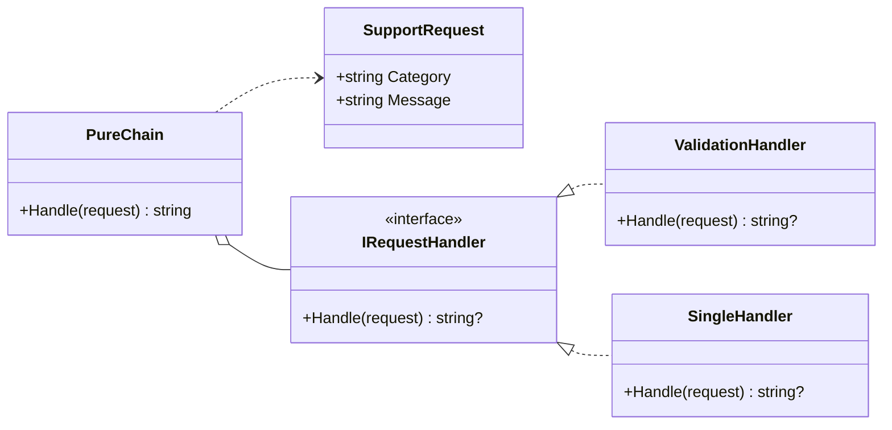
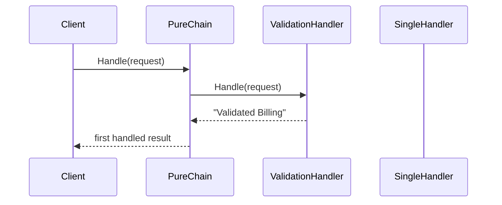

# Pure Chain

Pure chain models the version of Chain of Responsibility where the request stops at the first handler that can process it.

## Code Walkthrough

- `SupportRequest` carries the request data that flows through the chain.
- `IRequestHandler` is the abstraction every handler implements, so the chain depends on the interface instead of concrete classes.
- `ValidationHandler` returns `null` when it cannot process a request and a response when it can.
- `PureChain` iterates through handlers and stops immediately after the first non-null response.
- `SingleHandler` shows a concrete handler that can still be tested independently.

## How It Differs

- Pure chain has early exit behavior.
- Only one handler owns the final response.
- Later handlers are skipped once the request is handled.

## UML

## Example Flow

