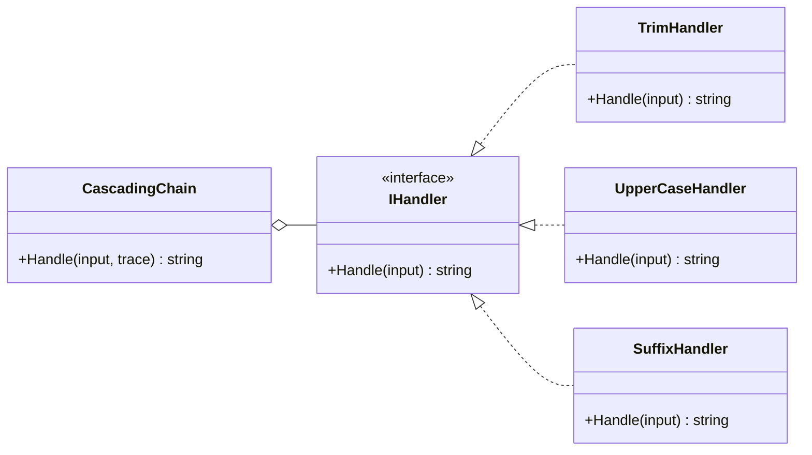
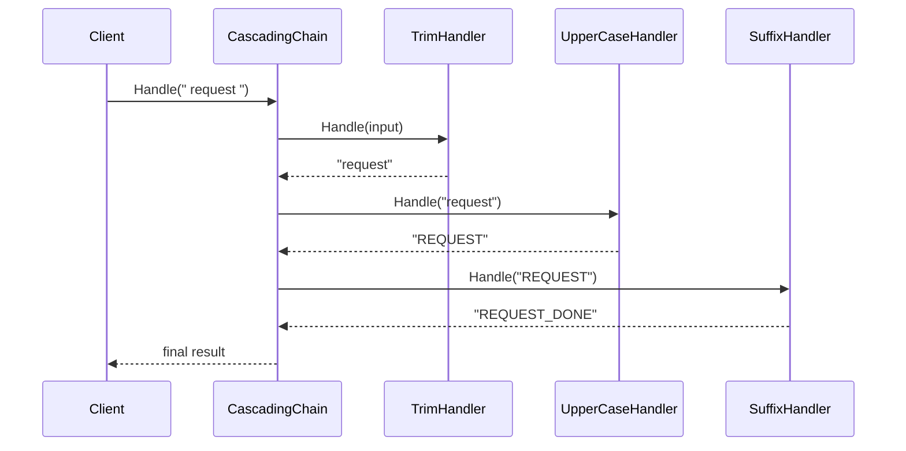

# Cascading Chain

Cascading chain models the version of Chain of Responsibility where every handler runs in sequence and each step feeds the next one.

## Code Walkthrough

- `IHandler` is the shared abstraction for transformation steps.
- `TrimHandler`, `UpperCaseHandler`, and `SuffixHandler` each transform the input independently.
- `CascadingChain` applies every handler in order and returns the final transformed value.
- `CascadingChainDemo` captures the trace so the sequence is easy to inspect.

## How It Differs

- Cascading chain has no early exit.
- Every handler contributes to the final output.
- Order matters because each step receives the previous step's result.

## UML

## Example Flow

