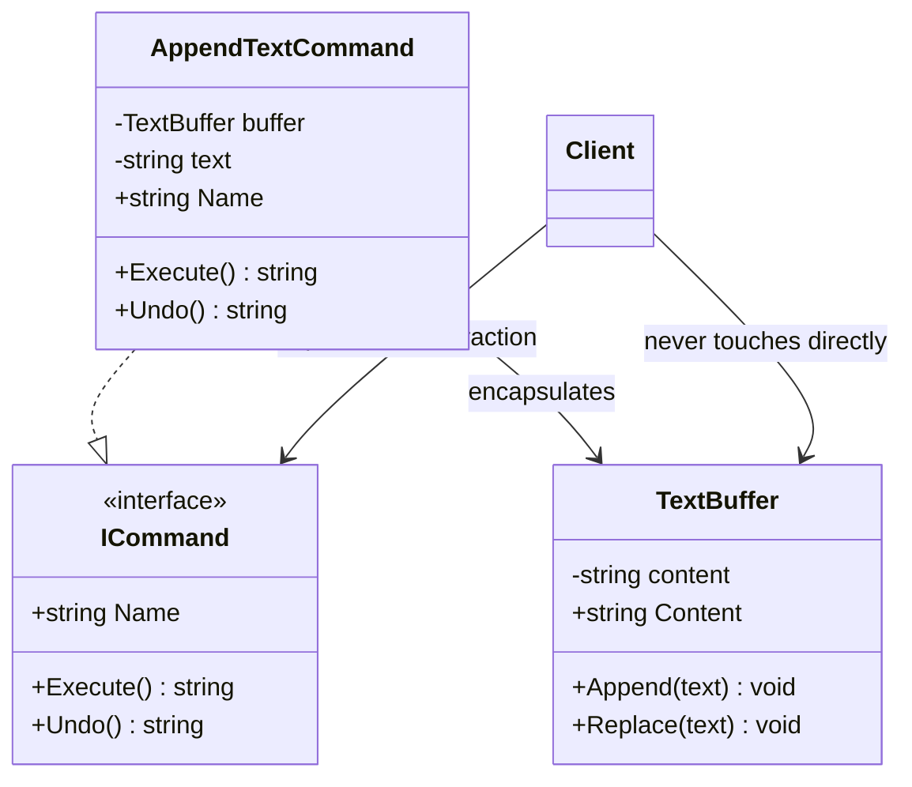

# 01 - Simple Command

## What this variant demonstrates

Simple Command encapsulates a request as a standalone object, allowing the decoupling of command execution from the invoker. Each command object holds a reference to a receiver and knows how to invoke the receiver's methods without exposing receiver internals.

### Code focus

```csharp
var buffer = new TextBuffer();
var appendCommand = new AppendTextCommand(buffer, "Hello");
var executed = appendCommand.Execute();
var undone = appendCommand.Undo();
```

In this variant:
- `ICommand` defines the contract (Execute and Undo methods).
- `AppendTextCommand` encapsulates the request to append text to a buffer.
- `TextBuffer` is the receiver that knows how to perform the actual operation.
- The invoker (client code) only knows about the `ICommand` abstraction, not the receiver internals.
- Each command is independent and testable in isolation.

## How it differs from other variants

- Compared to `02-CompositeCommand`: Simple Command operates on a single receiver with atomic operations; Composite Command combines multiple commands into a single executable unit.
- Compared to `03-UndoableCommand`: Simple Command includes basic undo capability; Undoable Command focuses on robust command history and selective reversion of previously executed commands.

## Core Principles

1. **Command Objects**: Commands encapsulate requests into objects.
2. **Receiver Abstraction**: The invoker never directly accesses receiver methods.
3. **Abstraction Dependency**: Code depends on `ICommand` interface, not concrete implementations.
4. **Atomic Operations**: Each command represents a single, cohesive operation.

## UML



## Test Checklist

- ✓ Command classes are executable without caller knowing receiver internals
- ✓ Invoker code accepts abstractions (ICommand interface)
- ✓ Command execution is testable in isolation with mocked receivers
- ✓ Undo operations safely revert command state
