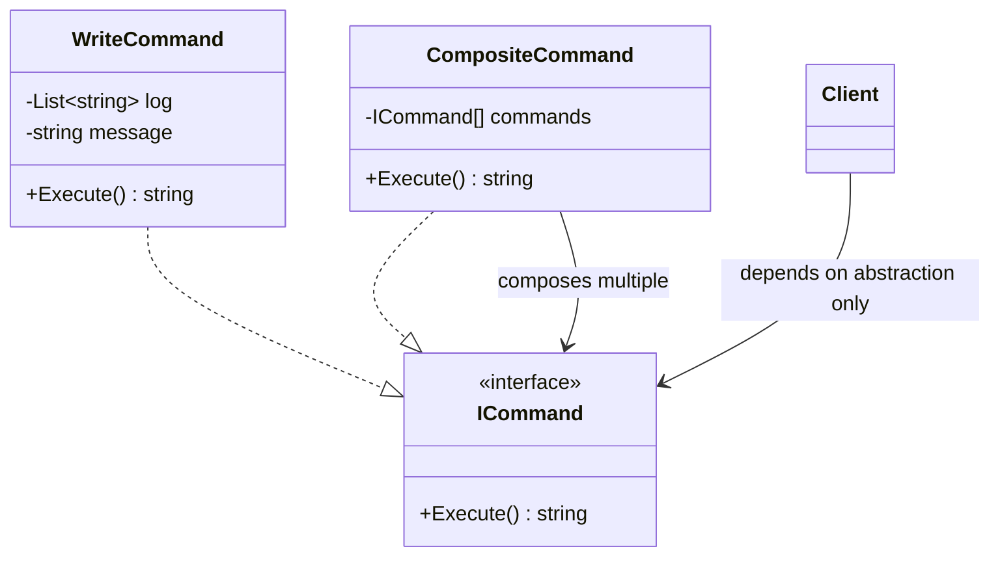

# 02 - Composite Command

## What this variant demonstrates

Composite Command composes multiple commands into a single command that executes them sequentially. This variant preserves execution order and allows treating a collection of commands as a single, cohesive unit without modifying the invoker code.

### Code focus

```csharp
var log = new List<string>();
ICommand composite = new CompositeCommand(
    new WriteCommand(log, "Validate"),
    new WriteCommand(log, "Persist"),
    new WriteCommand(log, "Publish"));

var result = composite.Execute();
// Result: "Validate | Persist | Publish"
```

In this variant:
- `ICommand` defines the contract for all command types.
- `WriteCommand` encapsulates a single write operation.
- `CompositeCommand` composes multiple commands and executes them in sequence.
- The invoker receives a single `ICommand` abstraction regardless of whether it's simple or composite.
- Execution order is preserved across child commands.
- Each command is independent and composable with others.

## How it differs from other variants

- Compared to `01-SimpleCommand`: Composite Command composes multiple commands into a single unit; Simple Command operates on individual atomic requests.
- Compared to `03-UndoableCommand`: Composite Command focuses on ordered composition of commands; Undoable Command focuses on reverting previously executed commands.

## Core Principles

1. **Composition**: Multiple commands combine into a single command object.
2. **Uniform Interface**: Composite and leaf commands share the same `ICommand` interface.
3. **Ordered Execution**: Child commands execute in the order they are added.
4. **Transparent to Invoker**: The invoker treats composite commands the same as simple commands.

## UML



## Test Checklist

- ✓ Command classes are executable without caller knowing receiver internals
- ✓ Invoker code accepts abstractions (ICommand interface)
- ✓ Composite commands preserve execution order across child commands
- ✓ Command execution is testable in isolation with mocked receivers
- ✓ Composite and leaf commands are interchangeable
