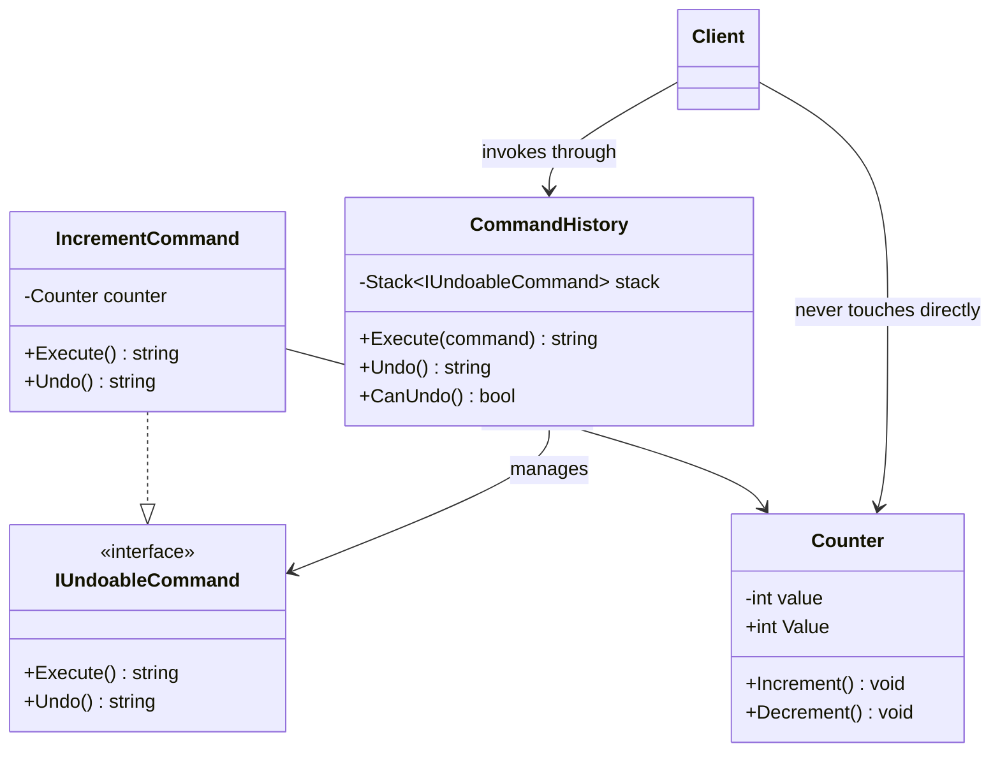

# 03 - Undoable Command

## What this variant demonstrates

Undoable Command maintains command history and enables reverting previously executed commands. This variant implements a stack-based undo mechanism that safely reverts only the commands that have been executed, preserving application state consistency.

### Code focus

```csharp
var counter = new Counter();
var command = new IncrementCommand(counter);

var afterExecute = command.Execute();  // Value=1
var afterUndo = command.Undo();         // Value=0
```

In this variant:
- `IUndoableCommand` defines the contract for commands that support undo.
- `IncrementCommand` encapsulates an operation and knows how to reverse it.
- `Counter` is the receiver that maintains state and provides undo-compatible operations.
- The invoker can execute commands and safely revert only previously executed ones.
- Undo operations are safe and don't affect commands that haven't been executed.
- Command execution state is tracked to ensure reversibility.

## How it differs from other variants

- Compared to `01-SimpleCommand`: Undoable Command focuses on robust command history management; Simple Command provides basic undo capability.
- Compared to `02-CompositeCommand`: Undoable Command emphasizes selective reversion of commands; Composite Command focuses on ordered composition.

## Core Principles

1. **Reversibility**: Each command knows how to undo its own action.
2. **State Management**: Commands maintain enough information to safely revert state.
3. **Execution Tracking**: Only executed commands can be undone.
4. **History Preservation**: Command history enables multi-step undo capability.

## UML



## Test Checklist

- ✓ Command classes are executable without caller knowing receiver internals
- ✓ Invoker code accepts abstractions (IUndoableCommand interface)
- ✓ Undoable commands safely revert only previously executed actions
- ✓ Undo operations restore state to pre-execution condition
- ✓ Command execution is testable in isolation with mocked receivers
- ✓ Multiple undo operations work correctly in sequence
