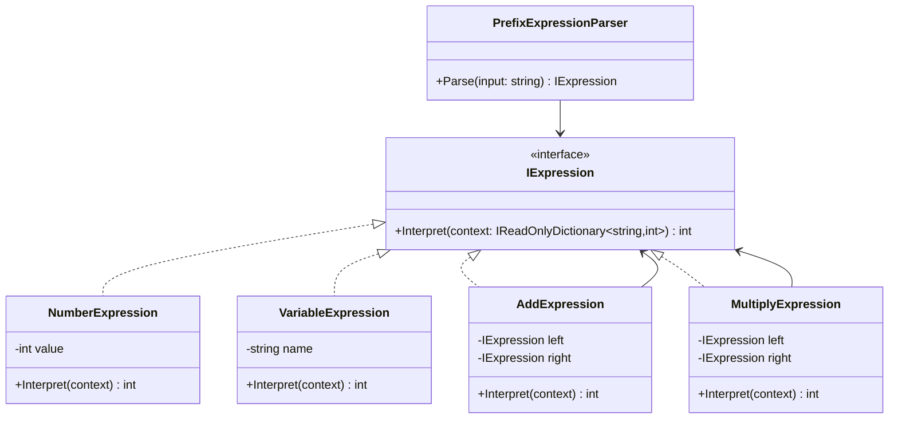

# 01-ASTInterpreter

## Intent
AST Interpreter models language rules as composable expression objects (an abstract syntax tree) and evaluates them recursively.

## Why this variant
Use AST Interpreter when you need strong composition, node-level testability, and predictable evaluation through a tree of expressions.

## How it differs from other variants
- AST Interpreter: behavior is distributed across expression node types (`NumberExpression`, `VariableExpression`, `AddExpression`, `MultiplyExpression`).
- Context-driven Interpreter: behavior is mostly rule-name dispatch over context, often with a registry of evaluators.

## Code Explanation
In this folder's API:
- `IExpression` is the common interpretation contract.
- Leaf nodes: `NumberExpression`, `VariableExpression`.
- Composite nodes: `AddExpression`, `MultiplyExpression`.
- `PrefixExpressionParser` converts text like `add 2 mul x 3` into an expression tree.
- Evaluation is explicit: caller passes context directly into `Interpret`.

This keeps expression logic isolated and easy to test in small units.

## UML (AST Interpreter)

## Trade-offs
- Clear and extensible for new node types/operators.
- Can introduce more classes for very small grammars.
