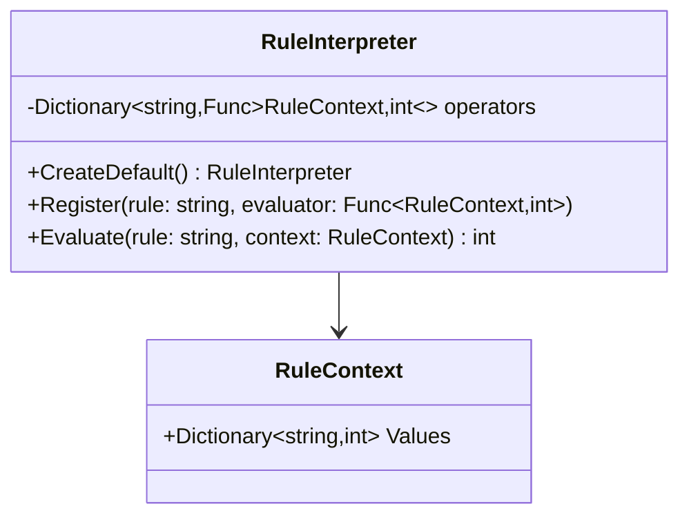

# 02-ContextDrivenInterpreter

## Intent
Context-driven Interpreter evaluates named rules using an explicit runtime context and a rule-to-evaluator mapping.

## Why this variant
Use this variant when rules are stable as named operations and you want runtime configurability through a context object and operator registration.

## How it differs from other variants
- Context-driven Interpreter: dispatches by rule name and context values.
- AST Interpreter: dispatches through expression object polymorphism and recursive tree evaluation.

## Code Explanation
In this folder's API:
- `RuleContext` holds explicit input data (`Values`).
- `RuleInterpreter` owns a registry of operators (`Register`) and evaluates by rule name.
- `CreateDefault()` wires baseline operators (`standard`, `priority`, `urgent`).
- New operators can be added without changing existing operator implementations.

This design keeps context explicit and avoids hidden global state.

## UML (Context-driven Interpreter)

## Trade-offs
- Simple to add/override named operators at runtime.
- Less structural grammar visibility than AST trees for complex expressions.
