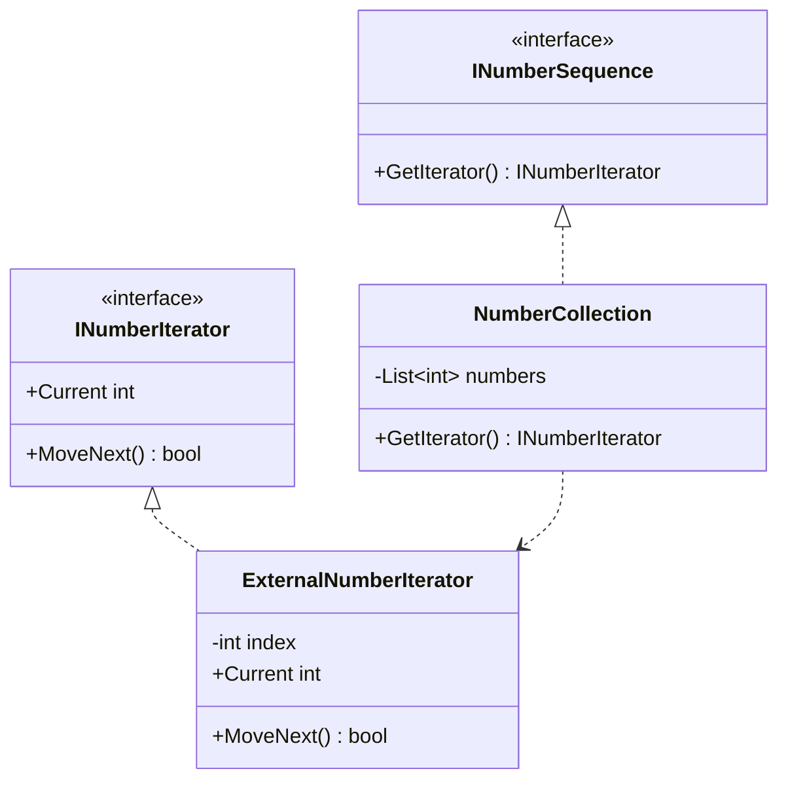
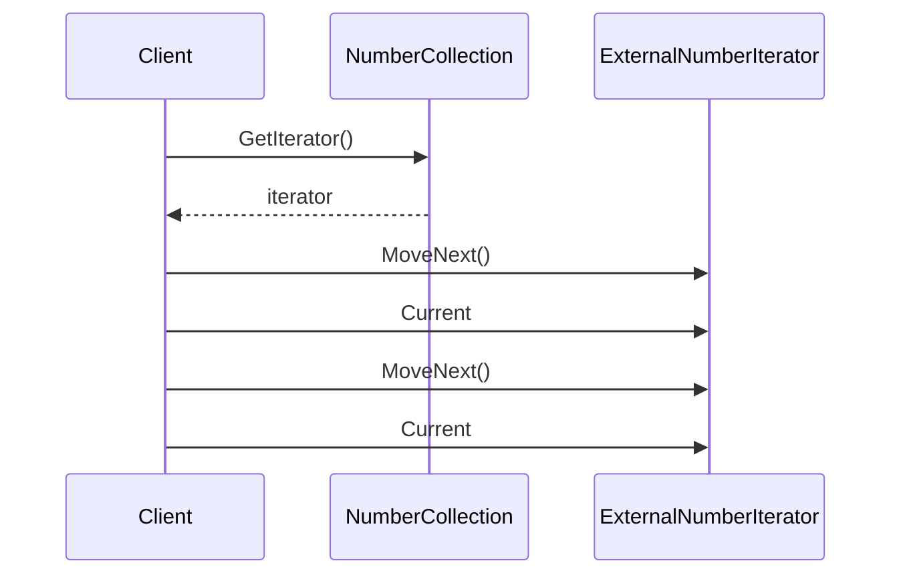

# External Iterator

External Iterator keeps traversal state in a dedicated iterator object. The caller explicitly advances through the collection one step at a time.

## Code Walkthrough

- `INumberSequence` hides the collection internals and exposes only iterator creation.
- `INumberIterator` is the traversal abstraction the caller depends on.
- `NumberCollection` stores the data and creates iterators without exposing its underlying list.
- `ExternalNumberIterator` owns the current index, so iteration state survives across multiple caller-controlled steps.

```csharp
public interface INumberSequence
{
    INumberIterator GetIterator();
}

public interface INumberIterator
{
    bool MoveNext();
    int Current { get; }
}
```

## How It Differs

- Compared to `02-InternalIterator`, the caller controls when traversal advances.
- Compared to `03-FailFastIterator`, this variant focuses on stateful stepping, not mutation detection.
- This is useful when callers need to pause, resume, or interleave traversal with other work.

## UML



## Example Flow


