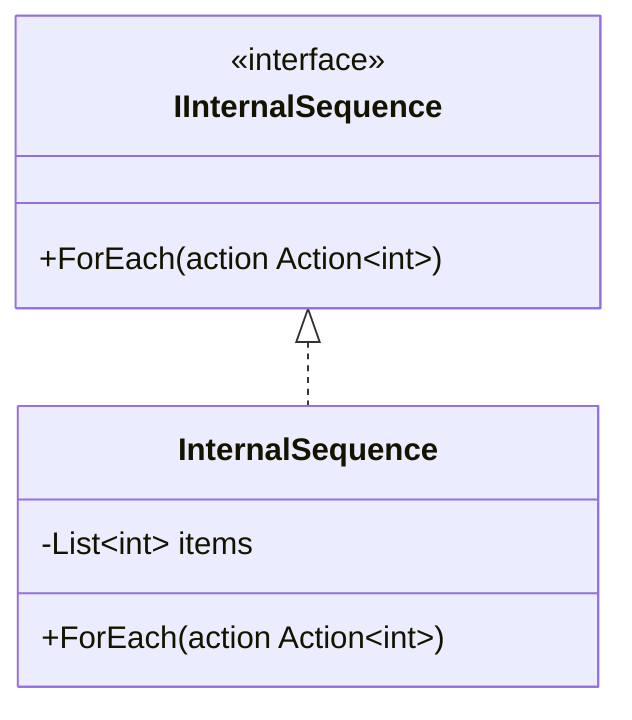
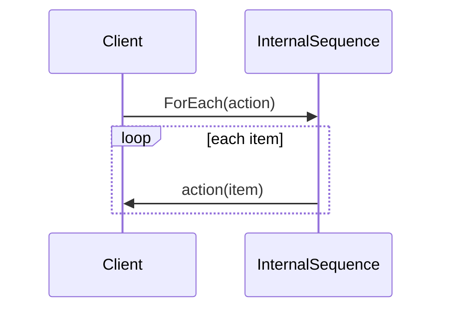

# Internal Iterator

Internal Iterator lets the collection own the traversal loop. Clients provide behavior to apply at each element instead of manually moving through the data.

## Code Walkthrough

- `IInternalSequence` is the abstraction callers target.
- `InternalSequence.ForEach` contains the traversal loop and invokes the supplied callback for each item.
- The client sees only values, not indexes or collection storage.

```csharp
public interface IInternalSequence
{
    void ForEach(Action<int> action);
}

public sealed class InternalSequence : IInternalSequence
{
    public void ForEach(Action<int> action)
    {
        foreach (var item in items)
        {
            action(item);
        }
    }
}
```

## How It Differs

- Compared to `01-ExternalIterator`, the collection controls traversal timing and state.
- Compared to `03-FailFastIterator`, this variant is about callback-driven traversal rather than concurrent modification checks.
- This fits pipelines where callers only need to apply work per item.

## UML



## Example Flow


