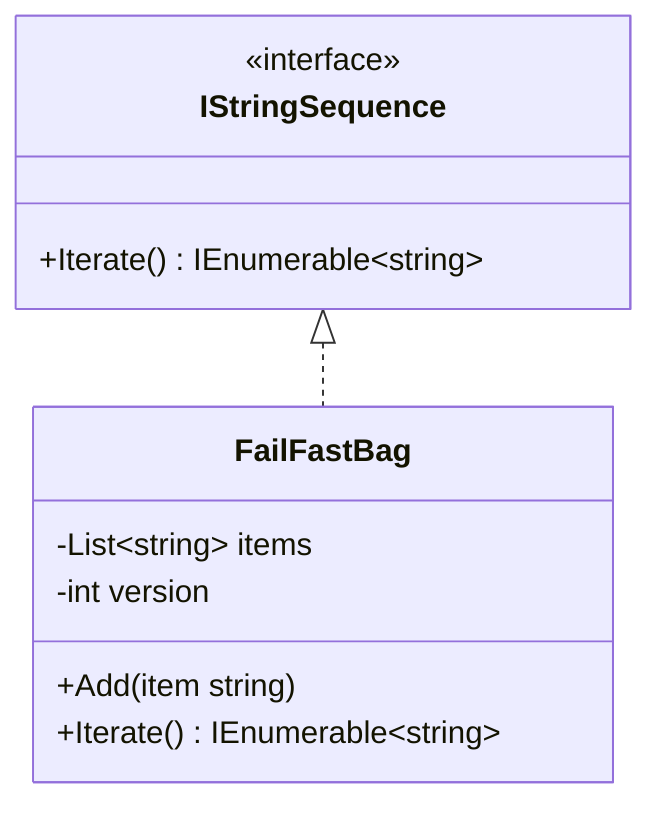
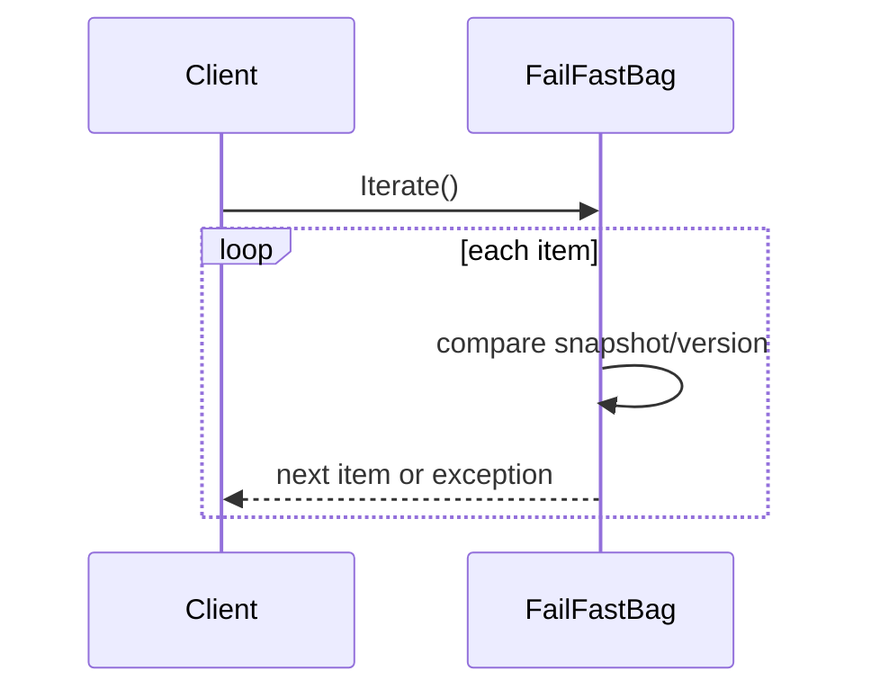

# Fail-Fast Iterator

Fail-fast Iterator detects structural mutation during traversal and throws immediately instead of continuing with stale iterator state.

## Code Walkthrough

- `IStringSequence` hides the collection internals behind an iteration contract.
- `FailFastBag` tracks a `version` that changes whenever items are added.
- `Iterate()` captures the starting version and validates it before each yielded item.
- If mutation occurs mid-traversal, the iterator throws `InvalidOperationException`.

```csharp
public sealed class FailFastBag : IStringSequence
{
    private int version;

    public IEnumerable<string> Iterate()
    {
        var snapshot = version;
        foreach (var item in items)
        {
            if (snapshot != version)
            {
                throw new InvalidOperationException("Collection modified during iteration.");
            }

            yield return item;
        }
    }
}
```

## How It Differs

- Compared to `01-ExternalIterator`, this variant prioritizes mutation safety over step-by-step caller control.
- Compared to `02-InternalIterator`, traversal is still exposed as an enumerable sequence rather than callback execution.
- This is useful when collections must reject concurrent structural changes deterministically.

## UML



## Example Flow


