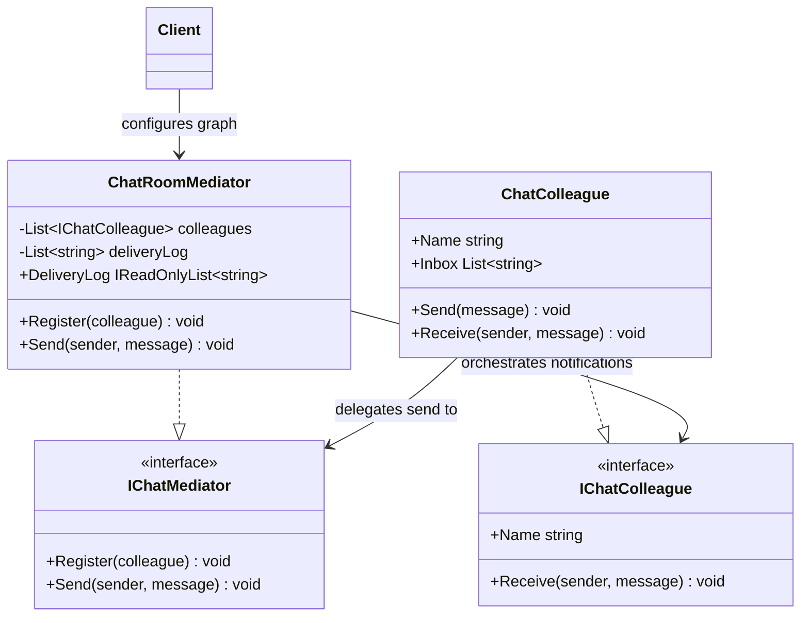

# 01 - Centralized Mediator

## What this variant demonstrates

A single mediator coordinates all colleague interactions inside one boundary (a chat room). Colleagues are decoupled from each other and communicate only through the mediator.

### Code focus

```csharp
var mediator = new ChatRoomMediator();
var alice = new ChatColleague("Alice", mediator);
var bob = new ChatColleague("Bob", mediator);

mediator.Register(alice);
mediator.Register(bob);
alice.Send("Release approved");
```

In this variant:

- `IChatMediator` defines registration and message orchestration.
- `IChatColleague` defines how colleagues receive notifications.
- `ChatRoomMediator` owns routing order and delivery workflow.
- `ChatColleague` delegates all cross-colleague communication to mediator.

## How it differs from other variants

- Compared to `02-HierarchicalMediator`: Centralized variant uses one mediator boundary; Hierarchical variant splits coordination across team mediator and parent mediator levels.
- Centralized variant is simpler for one coordination zone, while hierarchical is better for layered escalation flow.

## Core Principles

1. **No direct colleague calls**: communication always goes through mediator.
2. **Mediator-owned workflow order**: routing sequence lives in mediator logic.
3. **Single coordination boundary**: one mediator handles one collaboration context.
4. **Swappable colleagues**: peers can be replaced as long as they keep colleague interface.

## UML


