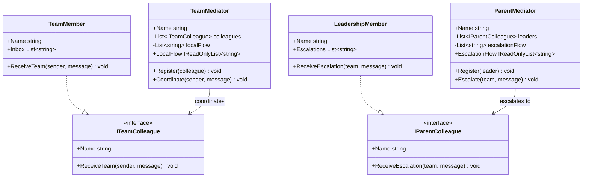

# 02 - Hierarchical Mediator

## What this variant demonstrates

Hierarchical mediator splits coordination across layers. Team-level mediators coordinate within a team boundary, while parent mediator handles cross-team escalation.

### Code focus

```csharp
var support = new TeamMediator("Support");
var parent = new ParentMediator("OperationsHub");

support.Register(new TeamMember("Sophie"));
parent.Register(new LeadershipMember("Director"));

support.Coordinate("Sophie", "Need approval");
parent.Escalate("Support", "Need approval");
```

In this variant:

- `TeamMediator` coordinates only team colleagues.
- `ParentMediator` coordinates only leadership escalation receivers.
- `ITeamColleague` and `IParentColleague` allow participant swapping without peer rewiring.
- Workflow ordering is explicit: local team coordination first, then optional escalation.

## How it differs from other variants

- Compared to `01-CentralizedMediator`: Hierarchical variant has multiple mediators with clear boundaries; centralized has one mediator for all collaborators.
- Hierarchical variant models layered organizations and escalation paths more naturally.

## Core Principles

1. **Layered boundaries**: each mediator has one coordination responsibility.
2. **No peer-to-peer coupling**: colleagues and leaders do not call each other directly.
3. **Orchestration flow in mediators**: coordination and escalation order are mediator rules.
4. **Replaceable participants**: any colleague can be swapped via interfaces.

## UML


