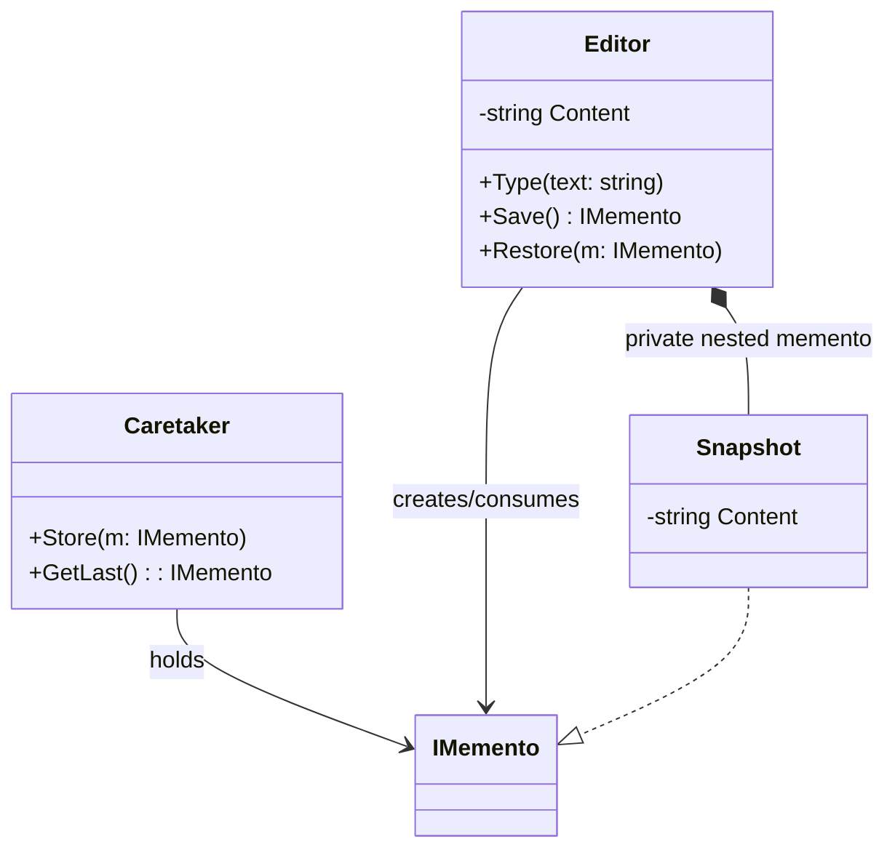

# 01-BlackBoxMemento

## Intent
Black-box Memento captures and restores originator state while keeping snapshot internals hidden from caretaker code.

## Why this variant
Use this variant when snapshot data may contain sensitive or invariant-critical fields. The caretaker stores mementos but cannot read or mutate their internals.

## How it differs from other variants
- Black-box: caretaker sees only an opaque `IMemento` token.
- White-box: caretaker can inspect and potentially modify snapshot fields.

## Code Explanation
In this folder's API:
- `Editor` is the originator.
- `IMemento` is an opaque contract exposed to caretaker code.
- `Editor.Save()` returns `IMemento`.
- `Editor.Restore(IMemento)` accepts only snapshots created by `Editor` and rejects foreign mementos.
- `Snapshot` is a private nested record inside `Editor`, so external code cannot access its state.

This keeps the restore logic safe and encapsulated while still allowing undo/rollback flows.

## UML (Black-box Memento)

## Trade-offs
- Strong encapsulation and safer invariants.
- Slightly less flexibility for caretaker-side inspection, filtering, or dedup based on snapshot content.
