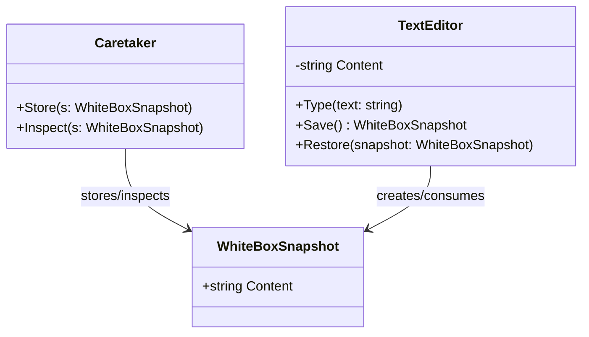

# 02-WhiteBoxMemento

## Intent
White-box Memento captures and restores state using a snapshot type whose fields are visible to caretaker code.

## Why this variant
Use this variant when snapshot visibility is intentional, for example auditing, diagnostics, serialization, or selective history management.

## How it differs from other variants
- White-box: snapshot structure is exposed, so caretakers can inspect values.
- Black-box: snapshot details are hidden behind an opaque interface and cannot be read directly.

## Code Explanation
In this folder's API:
- `TextEditor` is the originator.
- `WhiteBoxSnapshot` is a public snapshot type with exposed `Content`.
- `TextEditor.Save()` returns a concrete `WhiteBoxSnapshot`.
- `TextEditor.Restore(WhiteBoxSnapshot)` restores prior state from the provided snapshot.

Because the snapshot is visible, caretaker code can inspect historical values. This is convenient, but it also requires discipline to avoid unsafe mutation patterns.

## UML (White-box Memento)

## Trade-offs
- Easy debugging and audit visibility.
- Weaker encapsulation than black-box, so sensitive fields should not be stored in plain exposed snapshots.
