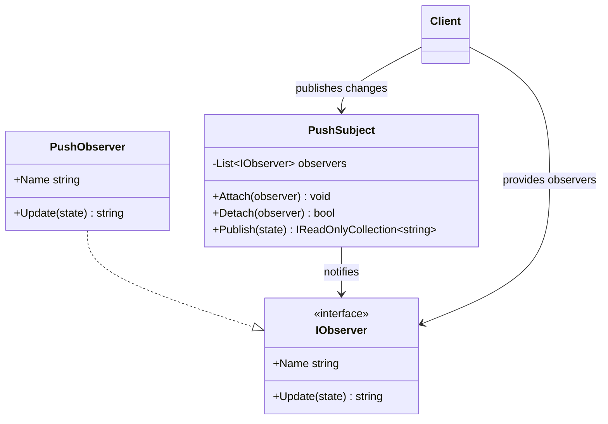

# 01 - Push Model

## What this variant demonstrates

Push Model observer sends the changed state directly from the subject to each observer during notification. Observers do not pull extra data from the subject; the subject pushes the payload.

### Code focus

```csharp
var subject = new PushSubject();
subject.Attach(new PushObserver("Email"));
subject.Attach(new PushObserver("Sms"));

var notifications = subject.Publish("Order placed");
```

In this variant:

- `IObserver` defines the observer abstraction.
- `PushSubject` owns observer lifecycle via `Attach` and `Detach`.
- `Publish(state)` pushes the state payload to observers in subscription order.
- The subject depends on the interface, not concrete observer implementations.

## How it differs from other variants

- Compared to `02-PullModel`: Push Model sends the new state directly in `Update(state)`; Pull Model notifies first, then observers read state from the subject.
- Compared to `03-EventDelegates`: Push Model uses explicit interfaces and classes; Event Delegates uses idiomatic C# events and handler subscriptions.

## Core Principles

1. **Push-based delivery**: Subject sends concrete state payload.
2. **Observer abstraction**: Subject knows only `IObserver`.
3. **Lifecycle control**: Attach/detach without changing subject internals.
4. **Deterministic ordering**: Notification order follows attach order.

## UML


