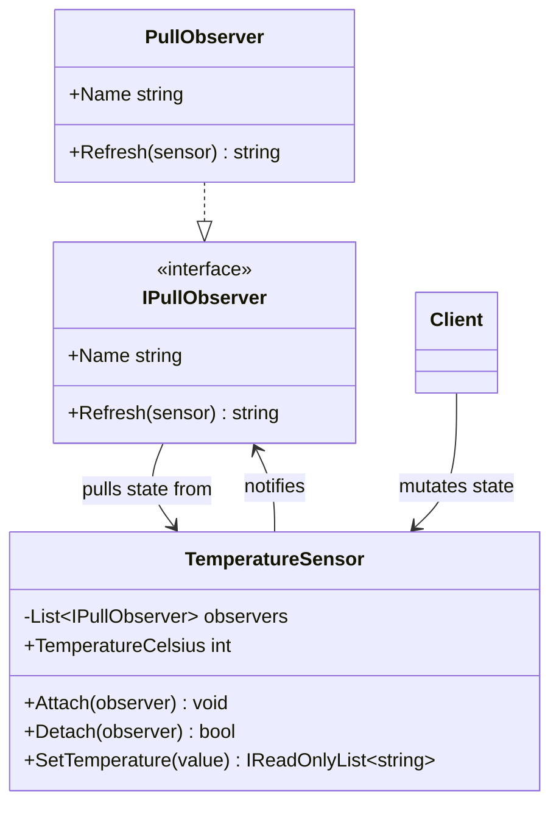

# 02 - Pull Model

## What this variant demonstrates

Pull Model observer notifications tell subscribers that state changed, and each observer then reads the current state from the subject. This is useful when observers need richer context than a single pushed payload.

### Code focus

```csharp
var sensor = new TemperatureSensor();
sensor.Attach(new PullObserver("Dashboard"));
sensor.Attach(new PullObserver("Alerting Service"));

var notifications = sensor.SetTemperature(28);
```

In this variant:

- `IPullObserver` defines observer behavior.
- `TemperatureSensor` stores authoritative state (`TemperatureCelsius`).
- `SetTemperature(...)` updates state and notifies observers.
- Observers call back into the subject via `Refresh(sensor)` to pull current data.

## How it differs from other variants

- Compared to `01-PushModel`: Pull Model observers read data from the subject; Push Model receives the full payload directly.
- Compared to `03-EventDelegates`: Pull Model uses explicit domain abstractions (`IPullObserver`, `TemperatureSensor`); Event Delegates uses lightweight event handlers.

## Core Principles

1. **Subject-owned state**: Source of truth remains in the subject.
2. **Pull-based read**: Observers read state when notified.
3. **Loose coupling**: Subject depends on `IPullObserver` only.
4. **Controlled subscriptions**: Attach/detach supported without changing subject logic.

## UML


