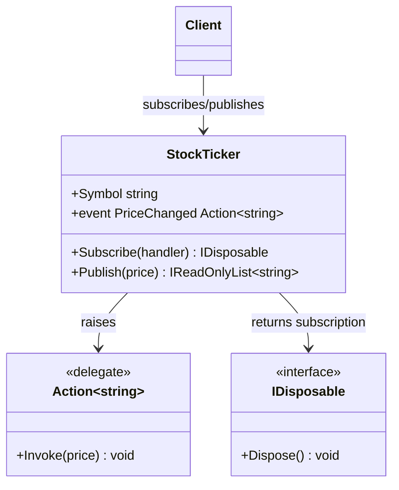

# 03 - Event Delegates

## What this variant demonstrates

Event Delegates implements Observer using idiomatic C# events. Subscribers register handlers, and the subject raises events when state changes.

### Code focus

```csharp
var ticker = new StockTicker("DOTNET");
var notifications = new List<string>();

using var subscription = ticker.Subscribe(price => notifications.Add($"Email: {price}"));
_ = ticker.Publish("$123.45");
```

In this variant:

- `StockTicker` exposes `PriceChanged` as an event.
- `Subscribe(handler)` returns `IDisposable` to make unsubscription explicit.
- `Publish(price)` raises the event to all current handlers.
- Handlers can be attached/detached with `+=` / `-=` or lifetime-managed via `Dispose()`.

## How it differs from other variants

- Compared to `01-PushModel`: Event Delegates avoids explicit observer interface types and uses language-level event syntax.
- Compared to `02-PullModel`: Event handlers usually consume pushed event data directly; Pull Model handlers typically pull additional data from the subject.

## Core Principles

1. **Idiomatic C# observer**: Use events and delegates.
2. **Subscription lifecycle**: Explicit attach/detach and disposable subscriptions.
3. **Testability**: Handlers can be replaced with in-memory test delegates.
4. **Order awareness**: Invocation order follows handler registration order.

## UML


