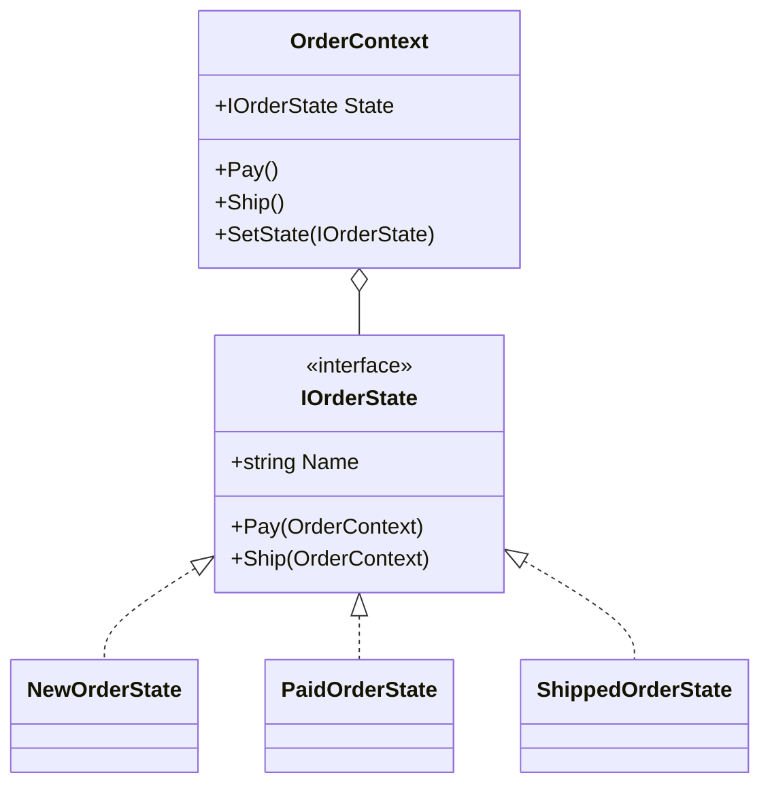

# Classic State Objects

This variant uses dedicated state classes to keep behavior close to the state that owns it.

## Why this variant

- Each state owns only the behavior that belongs to that state.
- Transitions are explicit because the current state object calls back into the context.
- The context stays small and only delegates to the active state.
- Invalid transitions are handled with clear responses instead of hidden branches.
- Callers work against `IOrderState`, so state objects can be swapped without changing the calling code.

## Code walkthrough

- `IOrderState` defines the shared contract for state behavior.
- `NewOrderState`, `PaidOrderState`, and `ShippedOrderState` implement the state-specific rules.
- `OrderContext` stores the current state and forwards `Pay()` and `Ship()` calls to it.
- `TrafficLightMachine` is included as a compact switch-based contrast inside the same sample project.

## UML

## How it differs from the enum-switch variant

The classic object form spreads behavior across multiple classes, which is easier to extend when transitions grow. The enum-switch version keeps all transitions in one method, which is shorter but less open to extension.