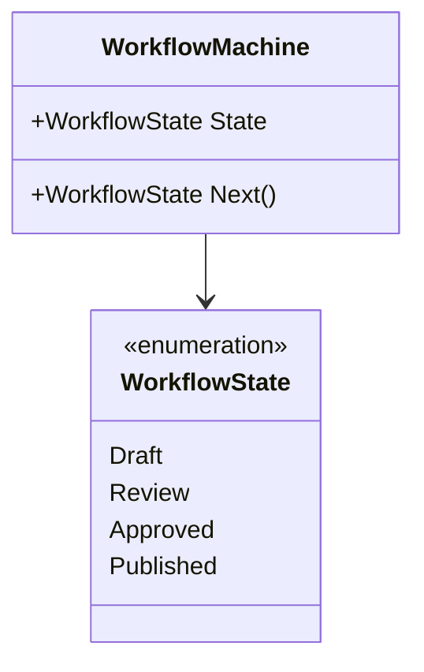

# State Machine

This variant uses a small enum plus a switch expression to move through the state graph.

## Why this variant

- The valid states are visible in one enum.
- Transitions are explicit in one switch expression.
- The machine is easy to scan when the state graph is small.
- Invalid or unexpected values are handled by the fallback branch.
- Callers only depend on `WorkflowMachine`, not on a hierarchy of state objects.

## Code walkthrough

- `WorkflowState` lists the allowed states.
- `WorkflowMachine.Next()` advances the machine with a switch expression.
- `StateMachineDemo` shows the sample behavior through a simple API response.

## UML

## How it differs from the classic object variant

The enum-switch variant centralizes all transition rules in one place. That makes the flow easy to read, but it is less flexible than dedicated state objects when state-specific behavior starts to grow.