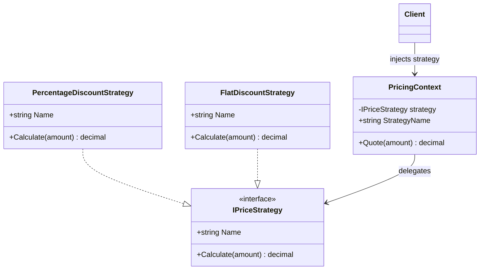

# 01 - DynamicStrategy

## What this variant demonstrates

Dynamic Strategy selects the algorithm at runtime by injecting an implementation through a shared interface.

### Code focus

```csharp
IPriceStrategy strategy = new PercentageDiscountStrategy(0.15m);
var context = new PricingContext(strategy);
var quote = context.Quote(200m);
```

In this variant:
- `IPriceStrategy` defines the common contract for all algorithms.
- `PricingContext` delegates pricing to the injected strategy.
- the client can swap strategies (`PercentageDiscountStrategy`, `FlatDiscountStrategy`) without changing context logic.

## How it differs from other variants

- Compared to `02-StaticStrategy`: strategy selection happens at runtime through dependency injection instead of compile-time generic binding.
- Compared to Composite variants: there is no tree recursion over child nodes; only one algorithm implementation is delegated per context.

## UML


