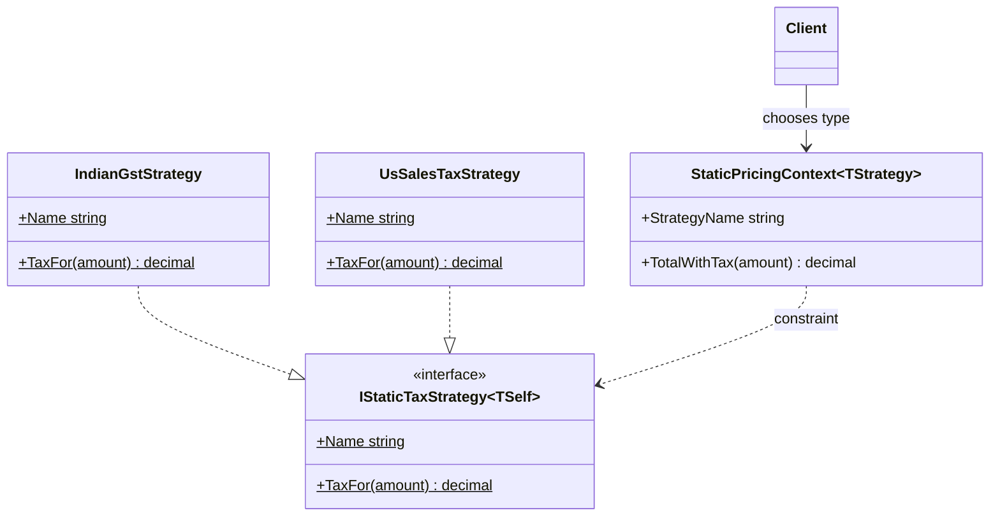

# 02 - StaticStrategy

## What this variant demonstrates

Static Strategy binds the algorithm at compile time using static abstract interface members and a generic context.

### Code focus

```csharp
var india = new StaticPricingContext<IndianGstStrategy>();
var us = new StaticPricingContext<UsSalesTaxStrategy>();

var indiaTotal = india.TotalWithTax(100m);
var usTotal = us.TotalWithTax(100m);
```

In this variant:
- `IStaticTaxStrategy<TSelf>` defines a compile-time strategy contract.
- `StaticPricingContext<TStrategy>` delegates tax computation to `TStrategy`.
- switching behavior means using a different generic type argument.

## How it differs from other variants

- Compared to `01-DynamicStrategy`: no runtime object injection is required; strategy resolution is compile-time and type-driven.
- Compared to Composite variants: there is no object hierarchy traversal; the context performs one direct, type-bound algorithm call.

## UML


