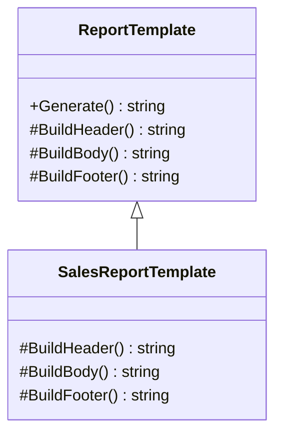
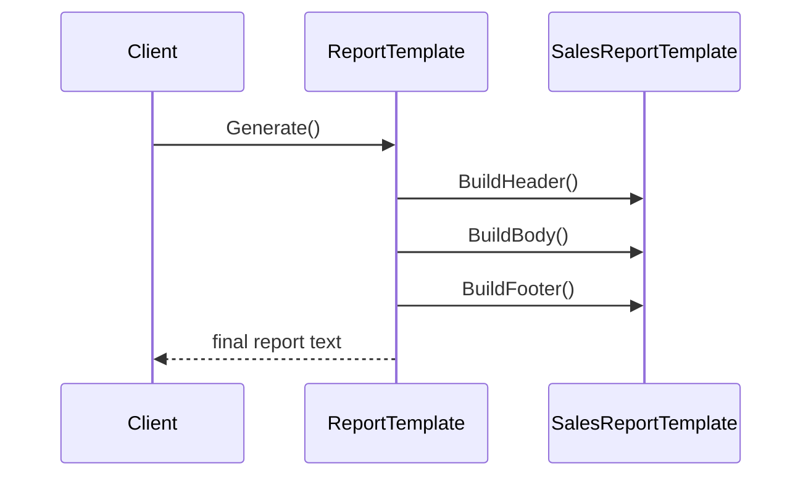

# Pure Template Method

Pure Template Method demonstrates the strict form of the pattern: the base class owns the entire algorithm sequence, and subclasses only supply the required step implementations.

## Code Walkthrough

- `ReportTemplate.Generate()` is the template method. It fixes the execution order as header, body, then footer.
- `BuildHeader`, `BuildBody`, and `BuildFooter` are the only variation points.
- `SalesReportTemplate` provides concrete step content without changing the overall workflow.

```csharp
public abstract class ReportTemplate
{
    public string Generate() => BuildHeader() + BuildBody() + BuildFooter();

    protected abstract string BuildHeader();
    protected abstract string BuildBody();
    protected abstract string BuildFooter();
}
```

## How It Differs

- Compared to `02-HookMethods`, this variant has no optional extension points.
- The algorithm is fully deterministic because derived types can only replace required steps.
- This is the best fit when every execution must follow the exact same shape.

## UML



## Example Flow


