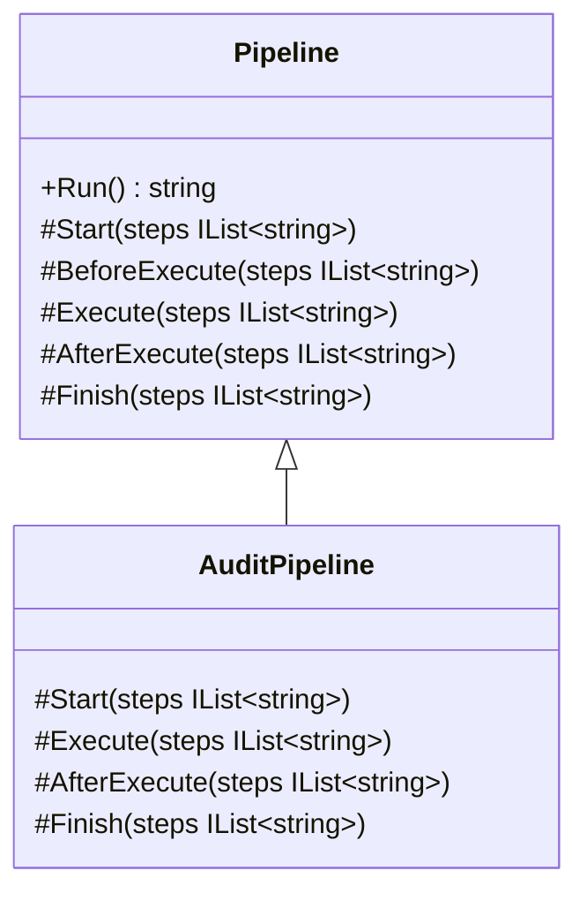
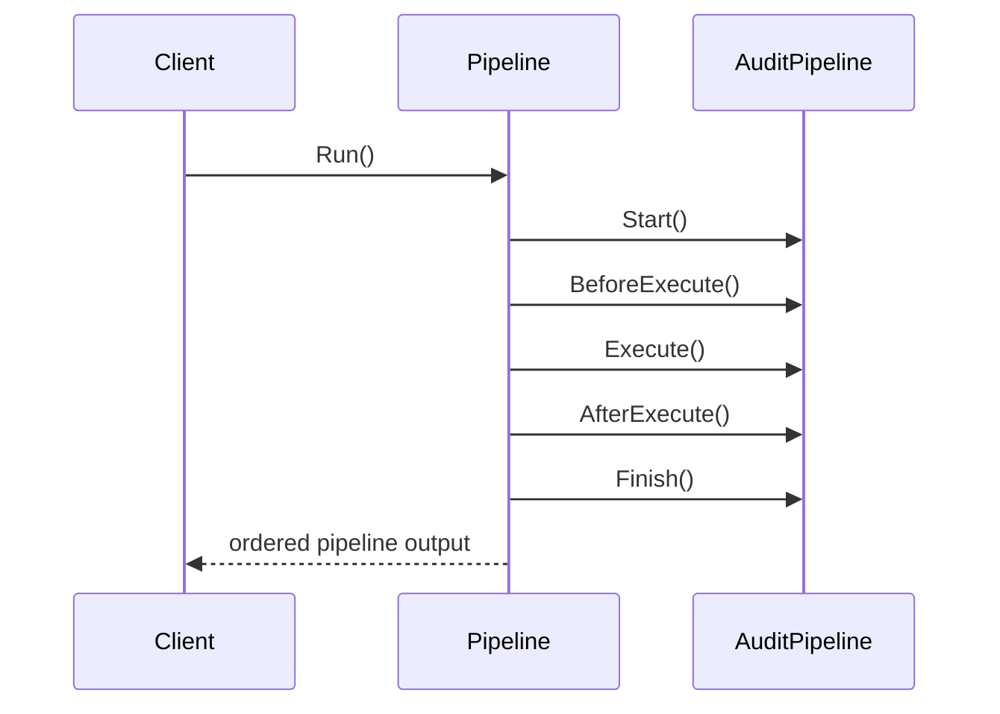

# Hook Methods

Hook Methods demonstrate the flexible Template Method variant where the base class still owns the sequence, but optional extension points can add behavior safely.

## Code Walkthrough

- `Pipeline.Run()` is the template method and remains the only place that controls execution order.
- `Start`, `Execute`, and `Finish` are required steps every subclass must provide.
- `BeforeExecute` and `AfterExecute` are hook methods with default no-op implementations.
- `AuditPipeline` overrides `AfterExecute` to add extra behavior without copying the full algorithm.

```csharp
public abstract class Pipeline
{
    public string Run()
    {
        Start(steps);
        BeforeExecute(steps);
        Execute(steps);
        AfterExecute(steps);
        Finish(steps);
    }

    protected virtual void BeforeExecute(IList<string> steps) { }
    protected virtual void AfterExecute(IList<string> steps) { }
}
```

## How It Differs

- Compared to `01-PureTemplateMethod`, this variant adds optional hooks for extension.
- Default hook behavior is safe because doing nothing still preserves a valid algorithm.
- Subclasses can inject extra behavior without taking ownership of the full workflow.

## UML



## Example Flow


