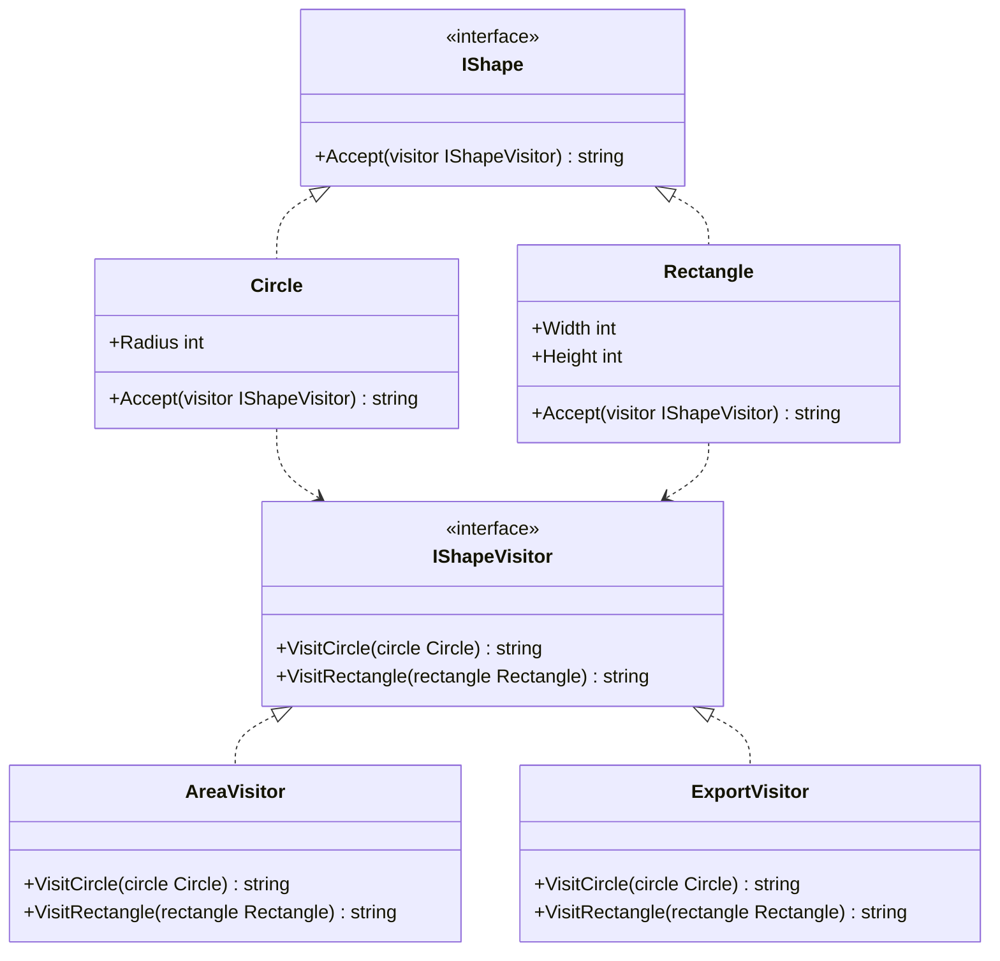
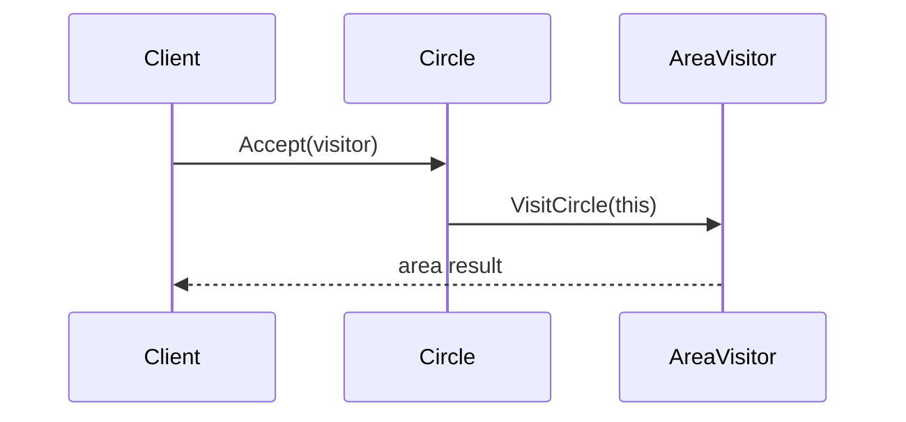

# Classic Visitor

Classic Visitor is the strict double-dispatch form of the pattern. Each element exposes one `Accept` method, and every visitor implements a visit overload for every element type in the hierarchy.

## Code Walkthrough

- `IShape` defines the stable element contract with `Accept(IShapeVisitor visitor)`.
- `IShapeVisitor` centralizes the operation contract with one method per concrete element.
- `Circle` and `Rectangle` delegate to the matching visit method, which gives classic double dispatch.
- `AreaVisitor` and `ExportVisitor` each stay focused on one operation.

```csharp
public interface IShape
{
    string Accept(IShapeVisitor visitor);
}

public interface IShapeVisitor
{
    string VisitCircle(Circle circle);
    string VisitRectangle(Rectangle rectangle);
}
```

## How It Differs

- Compared to `02-AcyclicVisitor`, this variant uses one central visitor interface.
- Adding a new operation is easy because you add a new visitor class.
- Adding a new element is more expensive because every visitor must grow a new visit method.

## UML



## Example Flow


