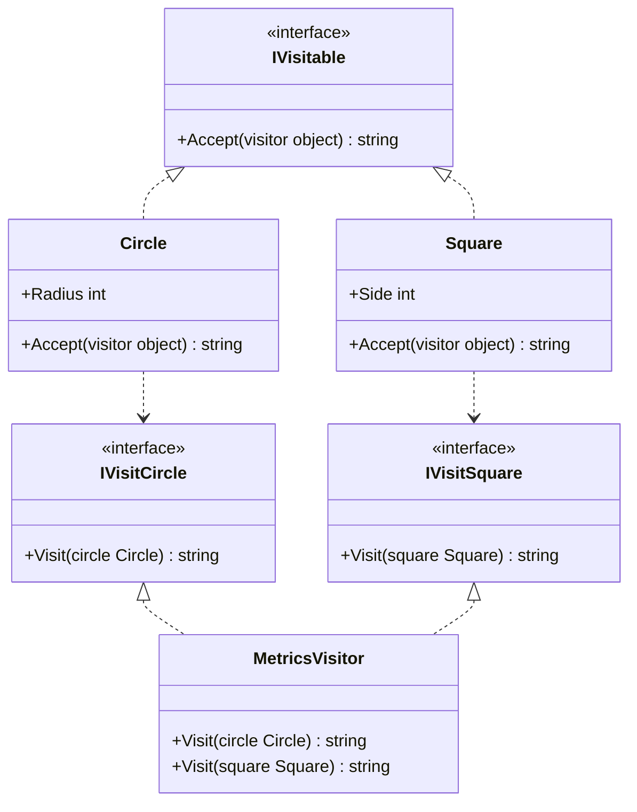
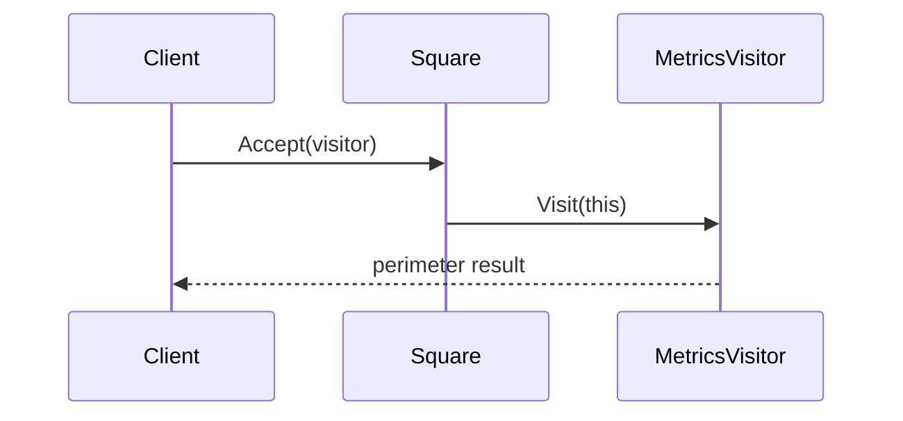

# Acyclic Visitor

Acyclic Visitor splits visitor capabilities into smaller role interfaces. Elements depend only on the visitor interfaces they need, which reduces coupling between unrelated element and visitor types.

## Code Walkthrough

- `IVisitable` exposes `Accept(object visitor)` as the shared entry point.
- `IVisitCircle` and `IVisitSquare` are fine-grained visitor roles instead of one monolithic interface.
- Each element checks whether the incoming visitor supports its role and dispatches only when that capability exists.
- `MetricsVisitor` is still focused on one operation, but it can opt into only the element roles it needs.

```csharp
public interface IVisitCircle
{
    string Visit(Circle circle);
}

public sealed record Circle(int Radius) : IVisitable
{
    public string Accept(object visitor)
        => visitor is IVisitCircle typed ? typed.Visit(this) : "No circle visitor";
}
```

## How It Differs

- Compared to `01-ClassicVisitor`, this variant avoids one central visitor interface.
- New element types do not force unrelated visitors to implement empty or unused methods.
- The trade-off is a looser contract because support is checked at runtime instead of being guaranteed by one interface.

## UML



## Example Flow


