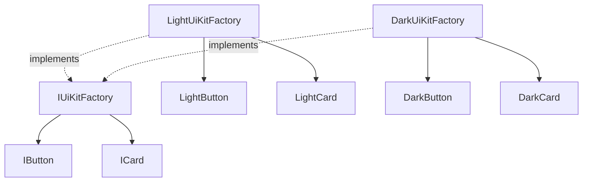

# Abstract Factory

This folder demonstrates how to create **families of related objects** without hard-coding the concrete classes used by the client.

## How the current implementation demonstrates the pattern

Both examples hide concrete product classes behind an abstract factory interface:

- the client talks to a factory abstraction
- the chosen factory produces a consistent family of products
- the client does not need to know whether it received light/dark UI components or economy/luxury vehicle creators

## Variants in this folder

| Folder | Key types | How it demonstrates Abstract Factory |
| --- | --- | --- |
| 01-KitFamilyOfRelatedObjects | `IUiKitFactory`, `IButton`, `ICard`, `LightUiKitFactory`, `DarkUiKitFactory` | One factory creates a matching set of UI controls, ensuring the objects belong to the same family. |
| 02-FactoryOfFactories | `IVehicleFactory`, `EconomyVehicleFactory`, `LuxuryVehicleFactory`, `VehicleFactoryProvider` | A provider chooses the right concrete factory, and that factory then creates related products together. |

## What the current code is showing

### 1. Kit: family of related objects

The `IUiKitFactory` contract guarantees that each theme can create both a button and a card. Choosing `DarkUiKitFactory` means both returned products belong to the dark family.

### 2. Factory of factories

`VehicleFactoryProvider.Create()` selects a concrete `IVehicleFactory`. After that, the client can create multiple related products such as a car and a bike from the same tier.

This is the main benefit of Abstract Factory: **consistency across related products**.

## Diagram

## Summary

The current implementation demonstrates Abstract Factory by selecting one factory object and then using it to create a **compatible set of products** that naturally belong together.
