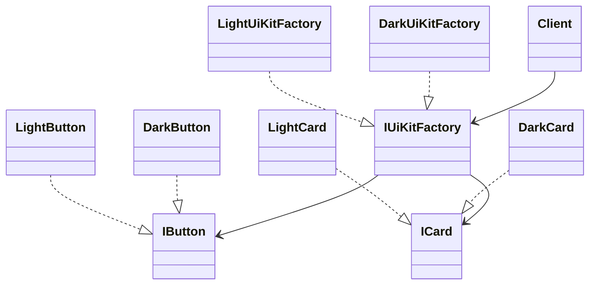

# Abstract Factory

This solution demonstrates how to create **families of related objects** without hard-coding the concrete classes chosen by the client.

---

## 1. Intro

The **Abstract Factory** pattern is a **creational design pattern** that provides an interface for creating a group of related products.

## Definition

**Abstract Factory** lets the client create entire families of related objects through a factory abstraction, without depending on the concrete classes of those objects.

Instead of directly instantiating matching products one by one, the client selects one factory and receives a consistent object family from it.

---

## 2. Core Components of the Design Pattern

| Pattern Role | Responsibility | Example from this solution |
| --- | --- | --- |
| **Abstract Factory** | Defines methods for creating related products | `IUiKitFactory`, `IVehicleFactory` |
| **Concrete Factory** | Produces a specific family of objects | `LightUiKitFactory`, `DarkUiKitFactory`, `EconomyVehicleFactory`, `LuxuryVehicleFactory` |
| **Abstract Product** | Shared contracts for created objects | `IButton`, `ICard`, vehicle product abstractions |
| **Concrete Product** | Concrete family members returned by factories | `LightButton`, `DarkCard`, economy and luxury products |
| **Client** | Uses the family through abstractions | Demo methods in each `PatternDemo.cs` |

### How the current code implements this pattern

- the client chooses a factory abstraction
- that factory creates a matching set of products
- all created objects belong to the same family
- the client remains independent from concrete implementations

---

## 3. Sub Types of Abstract Factory in this Solution

### 01 - Kit Family of Related Objects

A single UI kit factory creates components that belong together, such as matching buttons and cards.

### 02 - Factory of Factories

A provider selects the right vehicle factory, and that chosen factory then creates multiple related products in the same tier.

---

## 4. How These Variants Differ from Each Other

| Variant | Creation style | Best learning point |
| --- | --- | --- |
| **Kit Family Of Related Objects** | One factory directly returns a themed family | Product compatibility inside one family |
| **Factory Of Factories** | A provider first selects a concrete factory | Factory selection can itself be abstracted |

### Difference summary

- the first variant focuses on **consistent UI product families**
- the second variant focuses on **choosing the right factory first**, then producing related objects

---

## 5. Which SOLID Principles Are Applied

### **SRP — Single Responsibility Principle**
Factories create objects, while the products focus on their own behavior.

### **OCP — Open/Closed Principle**
You can add a new family of related products by introducing another concrete factory without changing client logic.

### **DIP — Dependency Inversion Principle**
The client depends on abstract factories and abstract products, not concrete implementations.

### **LSP — Liskov Substitution Principle**
Any concrete factory can replace another as long as it satisfies the same abstract factory contract.

---

## 6. UML Diagram



---

## 7. Types — Subtype Examples One by One

### Example 1: Kit Family Of Related Objects

```csharp
IUiKitFactory factory = new DarkUiKitFactory();
var button = factory.CreateButton();
var card = factory.CreateCard();
```

**What happens:**
- the client chooses one factory
- both returned products belong to the dark family
- the UI remains visually and behaviorally consistent

### Example 2: Factory Of Factories

```csharp
var factory = VehicleFactoryProvider.Create("luxury");
var car = factory.CreateCar();
var bike = factory.CreateBike();
```

**What happens:**
- the provider selects the correct concrete factory
- the factory creates related products from the same category
- the client stays decoupled from concrete classes

---

## How to Validate That This Implementation Is Correct

You can validate the Abstract Factory implementation using this checklist:

- **One factory creates a related family**: products created together should naturally belong together.
- **The client depends on abstractions**: code should talk to factory and product interfaces, not concrete classes.
- **Family switching is easy**: replacing one concrete factory with another should change the full family consistently.
- **Compatibility is preserved**: products from the same factory should work together as expected.
- **New families can be added cleanly**: introducing another factory should not require rewriting the client workflow.

### Practical validation steps

1. Select one concrete factory and create all related products.
2. Switch to another concrete factory and verify that the whole product family changes together.
3. Confirm the client code remains the same except for the chosen factory.
4. Add a new family and verify the existing client still works through the abstraction.

If these checks pass, the implementation correctly demonstrates Abstract Factory.

---

## Summary

The current implementation demonstrates Abstract Factory by selecting one factory object and using it to create a **compatible family of products** that work together naturally.
