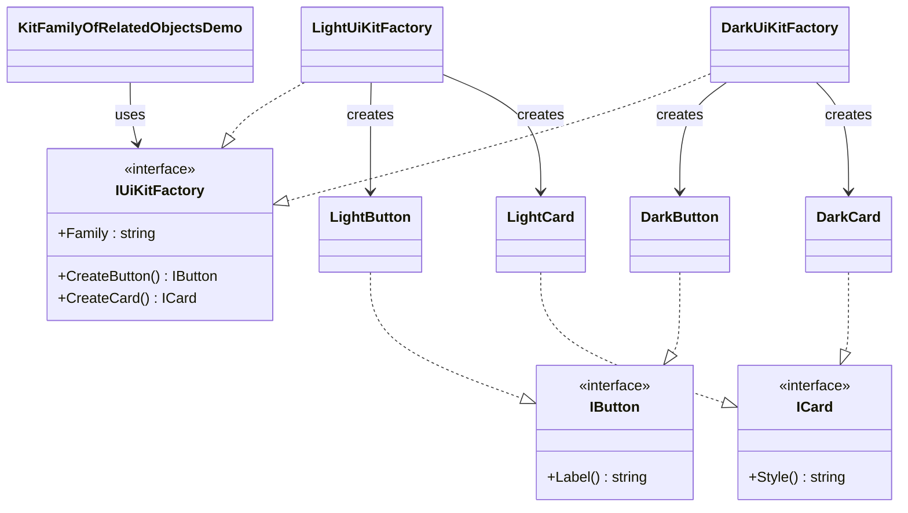

# 01 - Kit Family Of Related Objects

This subtype shows the classic Abstract Factory use case: create matching UI components from the same theme family.

---

## 1. Intent

Build a consistent set of related objects (Button and Card) without hard-coding concrete classes in client logic.

---

## 2. Core Classes in This Subtype

- IUiKitFactory
- IButton
- ICard
- LightUiKitFactory, DarkUiKitFactory
- LightButton, LightCard, DarkButton, DarkCard
- KitFamilyOfRelatedObjectsDemo

### Roles

- IUiKitFactory defines the family contract.
- LightUiKitFactory and DarkUiKitFactory produce matching components in one family.
- IButton and ICard define product contracts used by clients.
- Demo chooses one concrete factory and consumes abstractions only.

---

## 3. Thread-Safety Behavior

- No mutable shared singleton state is used here.
- Factory creation is stateless and request-scoped in the demo.
- Thread safety is generally not a concern for this variant unless shared mutable state is introduced.

---

## 4. Trade-Offs

- Pros: enforces product compatibility inside each family.
- Pros: client code is decoupled from concrete product classes.
- Cons: adding a new product type (for example, IModal) requires updates in all concrete factories.
- Cons: more types and interfaces than direct object creation.

---

## 5. How It Differs from 02 - Factory Of Factories

- This subtype selects a concrete family directly (Light or Dark) and creates products from that family.
- Factory Of Factories adds a provider layer that selects which concrete family factory to use based on input.
- This subtype focuses on family consistency; the other subtype focuses on runtime factory selection strategy.

---

## 6. Code Explanation

```csharp
public interface IUiKitFactory
{
    string Family { get; }
    IButton CreateButton();
    ICard CreateCard();
}

public sealed class DarkUiKitFactory : IUiKitFactory
{
    public string Family => "Dark";
    public IButton CreateButton() => new DarkButton();
    public ICard CreateCard() => new DarkCard();
}
```

Explanation:

- IUiKitFactory declares methods for each related product type.
- DarkUiKitFactory returns only Dark family members, preserving compatibility.
- Client code depends on IUiKitFactory, IButton, and ICard instead of concrete classes.

---

## 7. UML Diagram



---

## Summary

Use this subtype when you need families of related UI objects that must always be used together.
