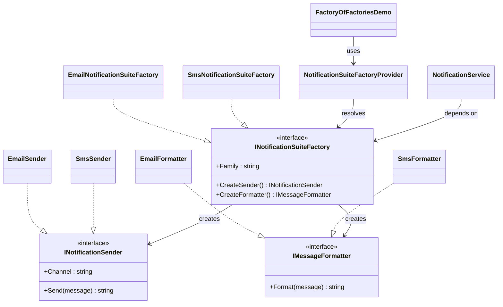

# 02 - Factory Of Factories

This subtype adds a provider that chooses a concrete notification suite factory at runtime.

---

## 1. Intent

Select the right concrete factory from input (channel) and keep service logic dependent only on abstract contracts.

---

## 2. Core Classes in This Subtype

- INotificationSuiteFactory
- INotificationSender
- IMessageFormatter
- EmailNotificationSuiteFactory, SmsNotificationSuiteFactory
- NotificationSuiteFactoryProvider
- NotificationService
- FactoryOfFactoriesDemo

### Roles

- INotificationSuiteFactory defines creation of matching sender and formatter.
- Concrete factories return family-matching products (Email + EmailFormatter, Sms + SmsFormatter).
- NotificationSuiteFactoryProvider resolves the concrete family factory from channel input.
- NotificationService depends only on abstractions and orchestrates formatting and sending.

---

## 3. Thread-Safety Behavior

- Current factories and service are stateless and do not share mutable global state.
- Provider method is deterministic and safe for concurrent use.
- No locks are required in this implementation.

---

## 4. Trade-Offs

- Pros: clear abstraction boundaries and easy extension for new channels.
- Pros: runtime selection stays isolated in provider logic.
- Cons: introduces extra abstraction and classes.
- Cons: provider must be updated to map new channel values.

---

## 5. How It Differs from 01 - Kit Family Of Related Objects

- This subtype adds one more layer (provider) to select which family factory to use.
- Kit Family picks a concrete factory directly; this subtype chooses via input.
- This subtype is ideal when channel/family is decided at runtime.

---

## 6. Code Explanation

```csharp
public static class NotificationSuiteFactoryProvider
{
    public static INotificationSuiteFactory Create(string channel)
    {
        if (string.IsNullOrWhiteSpace(channel))
            throw new ArgumentException("Channel must be provided.", nameof(channel));

        return channel.ToLowerInvariant() switch
        {
            "email" => new EmailNotificationSuiteFactory(),
            "sms" => new SmsNotificationSuiteFactory(),
            _ => throw new ArgumentOutOfRangeException(nameof(channel), channel,
                "Unsupported channel. Supported values are 'email' and 'sms'.")
        };
    }
}

public sealed class NotificationService
{
    private readonly INotificationSuiteFactory _factory;

    public NotificationService(INotificationSuiteFactory factory) => _factory = factory;

    public object Send(string message)
    {
        var payload = _factory.CreateFormatter().Format(message);
        return _factory.CreateSender().Send(payload);
    }
}
```

Explanation:

- Provider centralizes factory selection and fails fast for invalid channels.
- Service constructor accepts INotificationSuiteFactory only, so client logic remains abstraction-driven.
- Service composes related products from the same family, preserving compatibility.

---

## 7. UML Diagram



---

## Summary

Use this subtype when you need runtime factory selection while keeping services independent from concrete channel implementations.
