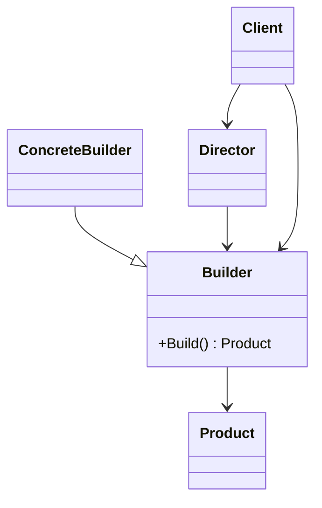

# Builder

This solution demonstrates how to construct complex objects **step by step** instead of relying on large constructors or scattered setup logic.

---

## 1. Intro

The **Builder** pattern is a **creational design pattern** that separates the process of building an object from the object that is finally produced.

## Definition

**Builder** lets you create a complex object gradually, using a sequence of clearly named steps, while keeping construction logic separate from the final representation.

This is especially useful when an object has required parts, optional parts, or multiple valid construction paths.

---

## 2. Core Components of the Design Pattern

| Pattern Role | Responsibility | Example from this solution |
| --- | --- | --- |
| **Product** | The final object being constructed | `ApiRequest`, deployment plan result, sandwich result |
| **Builder** | Defines the steps used to build the product | `ApiRequestBuilder`, `DeploymentPlanBuilder`, `ISandwichBuilder` |
| **Concrete Builder** | Stores state and assembles the final object | Builder implementations in each variant |
| **Director** | Optionally controls the building recipe | `SandwichDirector` |
| **Client** | Chooses steps and requests the final built object | Demo methods in each `PatternDemo.cs` |

### How the current code implements this pattern

- state is collected gradually through meaningful builder methods
- `Build()` returns the final assembled object
- object construction is easier to read and maintain than a long constructor call
- different builder styles show increasing control over the build process

---

## 3. Sub Types of Builder in this Solution

### 01 - Fluent Builder

Uses chainable methods so the client can configure the object in a readable way.

### 02 - Step Builder

Restricts the API so the client can only follow the valid sequence of required steps.

### 03 - Director-Based Builder

Separates the build recipe into a director that instructs the builder how to assemble the product.

---

## 4. How These Variants Differ from Each Other

| Variant | How creation happens | Flexibility | Best learning point |
| --- | --- | --- | --- |
| **Fluent Builder** | Chainable configuration methods | High | Readable setup with optional steps |
| **Step Builder** | Guided sequence through interfaces | Medium | Enforces required order |
| **Director-Based Builder** | A director controls the recipe | High | Reusable construction workflows |

### Difference summary

- **Fluent Builder** focuses on readability
- **Step Builder** focuses on correctness and order
- **Director-Based Builder** focuses on reusable assembly logic

---

## 5. Which SOLID Principles Are Applied

### **SRP — Single Responsibility Principle**
The builder handles construction, while the product holds final state and behavior.

### **OCP — Open/Closed Principle**
New building styles or recipes can be introduced without changing the client’s basic intent.

### **DIP — Dependency Inversion Principle**
The director-based example shows how clients can depend on builder abstractions instead of concrete implementations.

---

## 6. UML Diagram



---

## 7. Types — Subtype Examples One by One

### Example 1: Fluent Builder

```csharp
var request = new ApiRequestBuilder()
    .WithEndpoint("/orders")
    .UsingMethod("POST")
    .AddHeader("x-trace-id", "123")
    .Build();
```

**What happens:**
- the object is configured step by step
- the method chain stays readable
- the final object is created only when `Build()` is called

### Example 2: Step Builder

The builder exposes only the next valid step, ensuring the required order is followed.

### Example 3: Director-Based Builder

A reusable director contains the recipe, so the client can request a known product configuration easily.

---

## How to Validate That This Implementation Is Correct

You can validate the Builder implementation using this checklist:

- **Construction happens step by step**: the object should be assembled gradually, not through one large constructor.
- **The final object is produced by `Build()`**: the builder should own the assembly process.
- **Required steps are enforced where needed**: the step builder should prevent invalid construction order.
- **Optional configuration remains readable**: fluent methods should make the build sequence easy to understand.
- **Reusable recipes stay separate**: in the director-based version, the recipe should live outside the product itself.

### Practical validation steps

1. Use the builder to create a valid object and confirm the result contains the chosen state.
2. Check that the fluent API reads clearly and that `Build()` produces the final object.
3. Verify the step builder prevents missing mandatory steps.
4. Confirm the director can build the same recipe repeatedly without duplicating logic in the client.

If these checks pass, the implementation is correctly following the Builder pattern.

---

## Summary

The current code shows that Builder is useful when object creation has multiple steps, optional values, or reusable assembly rules, while keeping the final object easy to understand.
