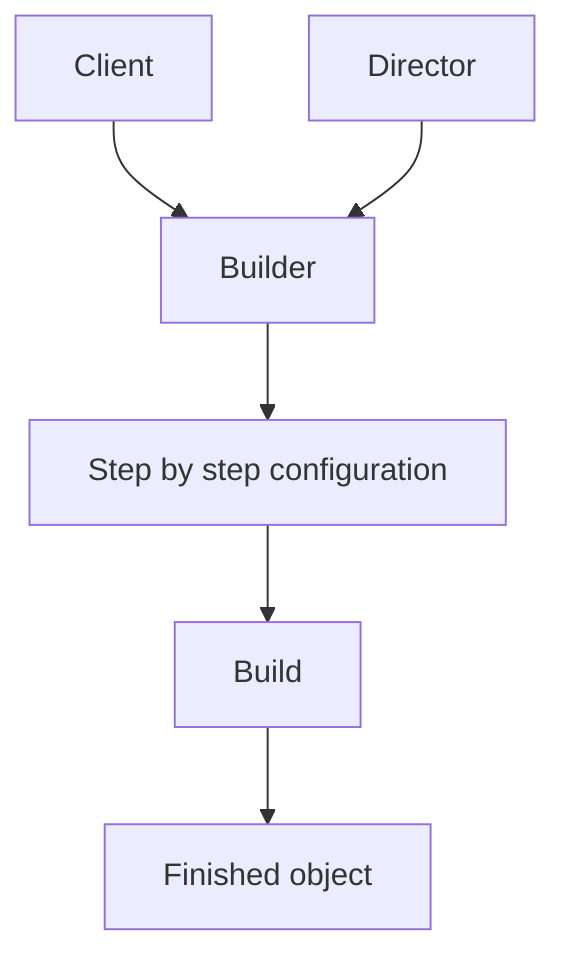

# Builder

This folder demonstrates different ways to build a complex object step by step instead of passing many constructor arguments at once.

## How the current implementation demonstrates the pattern

Each example separates **construction** from the final object:

- state is gathered gradually through builder methods
- `Build()` produces the final result
- the client reads clearly named steps instead of assembling everything in one constructor call

## Variants in this folder

| Folder | Key types | How it demonstrates Builder |
| --- | --- | --- |
| 01-FluentBuilder | `ApiRequestBuilder`, `ApiRequest` | Chainable methods such as `WithEndpoint()`, `UsingMethod()`, and `AddHeader()` gather data and then create the request in `Build()`. |
| 02-StepBuilder | `DeploymentPlanBuilder` and the step interfaces | The builder exposes only the next valid step, enforcing the order Name → Environment → Region → Optional settings. |
| 03-DirectorBasedBuilder | `ISandwichBuilder`, `SandwichBuilder`, `SandwichDirector` | A director owns the recipe and tells the builder exactly how to assemble the final sandwich. |

## What each example teaches

### 1. Fluent Builder

Best when you want readable method chaining and flexible ordering.

### 2. Step Builder

Best when certain steps are mandatory and should happen in a fixed sequence.

### 3. Director-based Builder

Best when the construction recipe should be reusable and separated from the concrete builder implementation.

## Diagram

## Summary

The current code shows that Builder is useful when object creation has multiple steps, optional values, or reusable assembly rules, while keeping the final object easy to understand.
