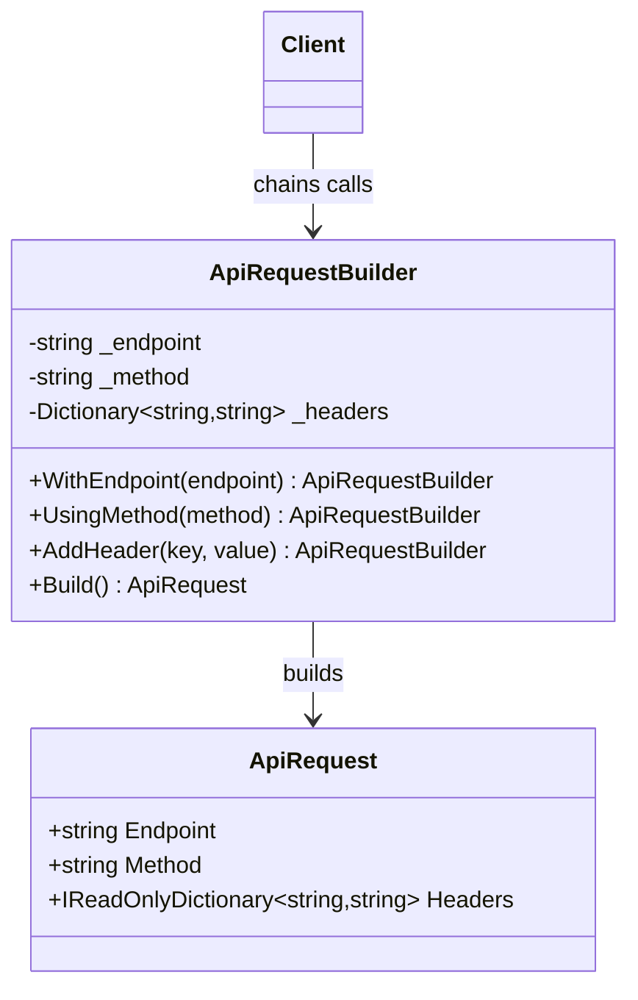

# 01 - FluentBuilder

## What this variant demonstrates

Fluent Builder uses chainable methods to configure an object in a readable, linear flow. Each method returns the same builder instance, and `Build()` produces the final object.

### Code focus

```csharp
var request = new ApiRequestBuilder()
    .WithEndpoint("/orders")
    .UsingMethod("POST")
    .AddHeader("x-correlation-id", Guid.NewGuid().ToString("N"))
    .Build();
```

In this variant:
- `ApiRequestBuilder` keeps temporary construction state.
- each fluent method modifies the state and returns the builder.
- `Build()` returns a new `ApiRequest` with a copied headers dictionary.

## How it differs from other Builder variants

- Compared to `02-StepBuilder`: Fluent Builder prioritizes flexibility and readability, while Step Builder prioritizes enforced order for required steps.
- Compared to `03-DirectorBasedBuilder`: Fluent Builder keeps recipe control with the client, while Director-Based Builder moves the recipe into a dedicated director.

## UML


