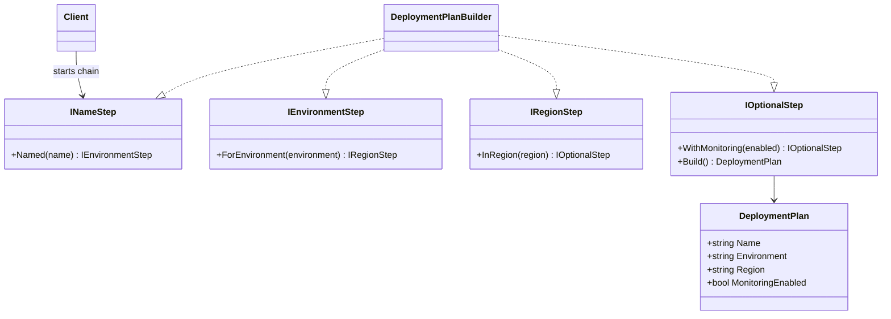

# 02 - StepBuilder

## What this variant demonstrates

Step Builder enforces the order of required construction steps by returning different interfaces at each stage.

### Code focus

```csharp
var plan = DeploymentPlanBuilder.Create()
    .Named("Payments")
    .ForEnvironment("Production")
    .InRegion("eu-west")
    .WithMonitoring()
    .Build();
```

In this variant:
- `Create()` returns `INameStep`.
- each step returns only the next valid step interface.
- sequence is enforced as `Name -> Environment -> Region -> Optional -> Build`.

## How it differs from other Builder variants

- Compared to `01-FluentBuilder`: Step Builder sacrifices some flexibility to guarantee construction order.
- Compared to `03-DirectorBasedBuilder`: Step Builder still lets the client drive the flow, but with compile-time guidance; Director-Based Builder centralizes recipe flow in a director.

## UML


