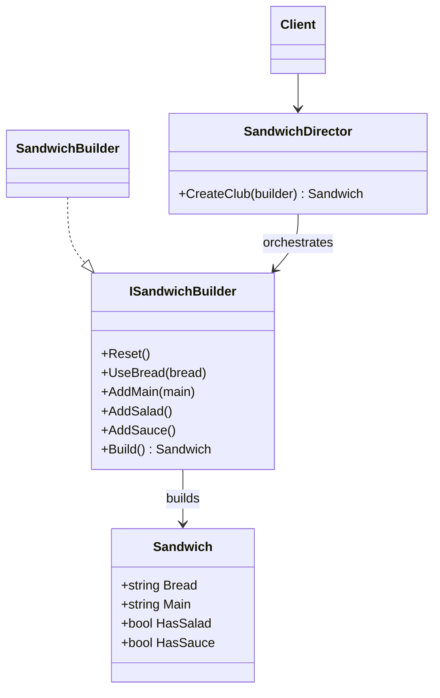

# 03 - DirectorBasedBuilder

## What this variant demonstrates

Director-Based Builder separates the build recipe from the builder implementation. The director controls which steps run and in what order.

### Code focus

```csharp
var director = new SandwichDirector();
var sandwich = director.CreateClub(new SandwichBuilder());
```

In this variant:
- `ISandwichBuilder` defines build operations.
- `SandwichBuilder` stores mutable construction state.
- `SandwichDirector` executes a reusable recipe (`CreateClub`).

## How it differs from other Builder variants

- Compared to `01-FluentBuilder`: client does not compose every step manually; the director applies a standard recipe.
- Compared to `02-StepBuilder`: order is controlled by the director's method, not by staged interfaces returned to the client.

## UML


