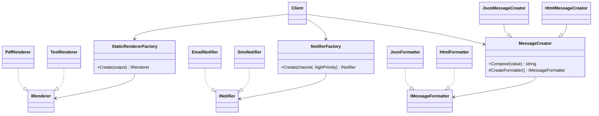

# Factory Method

This solution demonstrates how object creation can be separated from client logic so the caller works with abstractions instead of concrete classes. Each example builds on the previous one and shows a different style of creation control.

---

## 1. Intro

The **Factory Method** pattern is a **creational design pattern**. Its purpose is to encapsulate object creation and return products through a common abstraction.

Instead of writing concrete instantiation directly in the client, such as:

```csharp
var formatter = new JsonFormatter();
```

the client asks a creator or factory for an abstraction, and the creation decision is handled elsewhere.

In this solution, the pattern is presented in three progressive variants:

1. **Simple Factory**
2. **Parameterized Factory**
3. **Virtual Constructor**

These variants help show the path from basic centralized creation to the classic GoF Factory Method structure.

---

## 2. Core Components of the Design Pattern

The code in this folder uses the typical roles of the Factory Method pattern.

| Pattern Role | Responsibility | Example from this solution |
| --- | --- | --- |
| **Product** | Defines the common contract for created objects | `IRenderer`, `INotifier`, `IMessageFormatter` |
| **Concrete Product** | Actual implementation returned to the client | `PdfRenderer`, `TextRenderer`, `EmailNotifier`, `SmsNotifier`, `JsonFormatter`, `HtmlFormatter` |
| **Creator / Factory** | Encapsulates object creation logic | `StaticRendererFactory`, `NotifierFactory`, `MessageCreator` |
| **Concrete Creator** | Specializes the creator and decides what product to build | `JsonMessageCreator`, `HtmlMessageCreator` |
| **Client** | Uses the returned abstraction without knowing the exact class | Demo methods in each `PatternDemo.cs` |

### How the current code implements this pattern

- The client requests a product using a factory or creator.
- The factory or creator decides which concrete class should be instantiated.
- The result is returned through a shared interface.
- The client uses the object without tight coupling to the concrete implementation.

This reduces direct dependencies and makes the system easier to extend.

---

## 3. Sub Types of Factory Method in this Solution

### 01 - Simple Factory

This is the most beginner-friendly version. A static method checks the requested output and returns the appropriate renderer.

**Implementation in this solution:**
- `StaticRendererFactory.Create("pdf")`
- returns either `PdfRenderer` or `TextRenderer`
- both implement `IRenderer`

**Key characteristic:**
A centralized static method controls creation.

---

### 02 - Parameterized Factory

This version expands the simple factory idea by using more than one runtime input.

**Implementation in this solution:**
- `NotifierFactory.Create(channel, highPriority)`
- returns `SmsNotifier` when the priority is high or the selected channel is SMS
- otherwise returns `EmailNotifier`

**Key characteristic:**
Creation is based on business rules and runtime parameters.

---

### 03 - Virtual Constructor

This is the closest version to the original GoF Factory Method pattern.

**Implementation in this solution:**
- `MessageCreator` contains the workflow method `Compose()`
- inside `Compose()`, it calls `CreateFormatter()`
- subclasses such as `JsonMessageCreator` and `HtmlMessageCreator` override the factory method

**Key characteristic:**
The base workflow remains unchanged, while subclasses decide which product to create.

---

## 4. How These Variants Differ from Each Other

| Variant | How creation happens | Flexibility | Best learning point |
| --- | --- | --- | --- |
| **Simple Factory** | One static method returns a concrete object using a `switch` expression | Low to Medium | Centralizes construction |
| **Parameterized Factory** | Factory selects the object using multiple runtime inputs | Medium | Adds rule-based decision making |
| **Virtual Constructor** | Subclasses override the factory method | High | Demonstrates true Factory Method via polymorphism |

### Difference summary

- **Simple Factory** is the easiest to understand but less extensible.
- **Parameterized Factory** is more dynamic because creation depends on multiple conditions.
- **Virtual Constructor** is the most scalable and most aligned with the original design pattern.

---

## 5. Which SOLID Principles Are Applied

### **SRP — Single Responsibility Principle**
Creation logic is separated from the client usage logic.

- factories create objects
- products perform the actual work
- clients simply consume abstractions

### **OCP — Open/Closed Principle**
The client remains unchanged while new concrete products can be introduced.

This principle is followed most strongly in the **Virtual Constructor** example.

### **DIP — Dependency Inversion Principle**
The client depends on interfaces such as `IRenderer`, `INotifier`, and `IMessageFormatter`, not on concrete implementations.

### **LSP — Liskov Substitution Principle**
Any concrete implementation can replace the interface contract without affecting client behavior.

---

## 6. UML Diagram



---

## 7. Types — Subtype Examples One by One

### Example 1: Simple Factory

```csharp
var renderer = StaticRendererFactory.Create("pdf");
var output = renderer.Render("Quarterly report");
```

**What happens:**
- the factory reads the requested output type
- it creates `PdfRenderer`
- the client uses only the `IRenderer` contract

---

### Example 2: Parameterized Factory

```csharp
var notifier = NotifierFactory.Create("email", highPriority: true);
var result = notifier.Send("Deployment completed");
```

**What happens:**
- the factory checks both the channel and priority
- because the message is high priority, it returns `SmsNotifier`
- the client still uses the `INotifier` abstraction

---

### Example 3: Virtual Constructor

```csharp
MessageCreator creator = new JsonMessageCreator();
var output = creator.Compose("Hello from the factory method pattern");
```

**What happens:**
- the base class executes the common workflow
- the subclass decides which formatter to create
- the output changes without changing the client workflow

---

## Summary

The current implementation shows that Factory Method is not only about creating objects. It is about **reducing coupling**, **improving extensibility**, and **letting the client depend on abstractions rather than concrete classes**.
