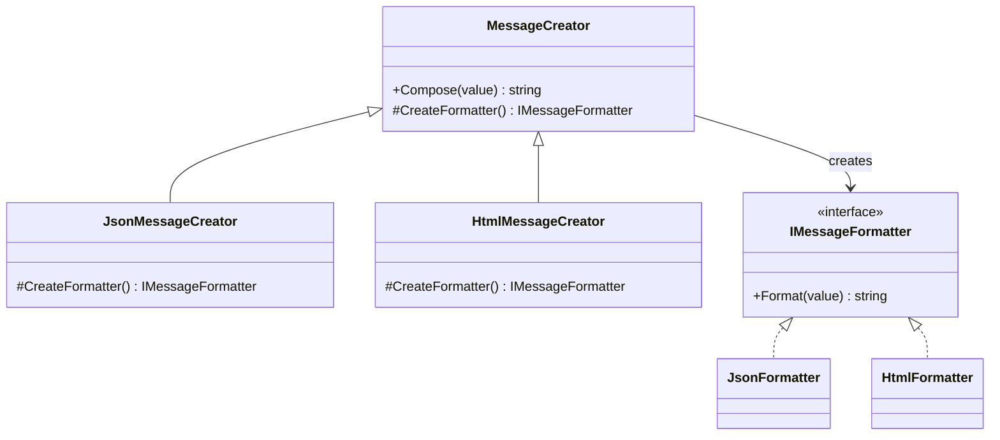

# Factory Method

This folder shows how object creation can be moved out of client code so the caller works with abstractions instead of concrete classes.

## How the current implementation demonstrates the pattern

The examples progressively move from a simple centralized creator toward the classic **Factory Method** style:

- client code asks for a product through a creator/factory
- the concrete product is chosen based on input or subclass behavior
- the caller depends on interfaces such as `IRenderer`, `INotifier`, and `IMessageFormatter`

## Variants in this folder

| Folder | Key types | How it demonstrates creation logic |
| --- | --- | --- |
| 01-SimpleFactory | `StaticRendererFactory`, `IRenderer`, `PdfRenderer`, `TextRenderer` | A static factory method chooses which renderer to instantiate based on the requested output format. |
| 02-ParameterizedFactory | `NotifierFactory`, `INotifier`, `EmailNotifier`, `SmsNotifier` | The factory uses runtime parameters such as channel and priority to decide which notifier to return. |
| 03-VirtualConstructor | `MessageCreator`, `JsonMessageCreator`, `HtmlMessageCreator` | The base class delegates product creation to an overridable factory method, which is the closest match to the GoF Factory Method pattern. |

## What each implementation is teaching

### 1. Simple Factory

`StaticRendererFactory.Create()` hides the constructor selection. The client gets an `IRenderer`, not a specific renderer class.

### 2. Parameterized Factory

`NotifierFactory.Create(channel, highPriority)` shows that runtime conditions can influence which implementation is returned.

### 3. Virtual Constructor

`MessageCreator.Compose()` uses `CreateFormatter()` internally. Subclasses decide which formatter to create, while the base class keeps the composition workflow unchanged.

## UML diagram

## Summary

The current code shows that the pattern is not about object creation alone, but about making creation **replaceable and extensible** without changing the client workflow.
