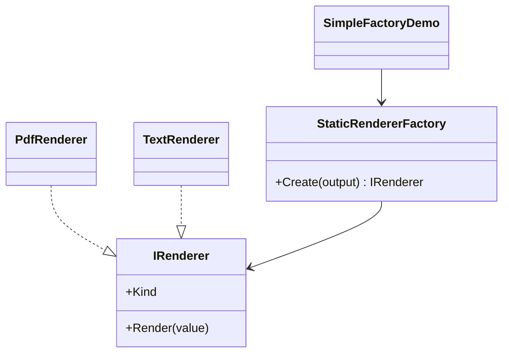

# 01 - Simple Factory

This example shows the most basic version of factory-based creation. The client does not directly instantiate a renderer. Instead, it asks a factory for an object that implements a common abstraction.

---

## 1. Intro

The goal of this example is to centralize creation logic in one place. The caller does not need to know which concrete renderer class should be used.

In the code, the client calls:

```csharp
var renderer = StaticRendererFactory.Create("pdf");
```

Instead of calling a concrete constructor directly.

This is a practical introduction to the Factory Method idea, even though it is technically a **Simple Factory** variant.

---

## 2. Core Components Design Pattern

| Role | Type in code | Responsibility |
| --- | --- | --- |
| **Product** | `IRenderer` | Common contract for all renderers |
| **Concrete Products** | `PdfRenderer`, `TextRenderer` | Render output in different formats |
| **Factory** | `StaticRendererFactory` | Chooses which renderer to create |
| **Client** | `SimpleFactoryDemo.Create()` | Uses the returned object through the abstraction |

### Implementation flow

1. The client requests a renderer from `StaticRendererFactory`.
2. The factory checks the `output` value.
3. A `switch` expression decides whether to create `PdfRenderer` or `TextRenderer`.
4. The object is returned as `IRenderer`.
5. The client calls `Render()` without depending on the concrete class.

---

## 3. Sub Types of It

This example itself is the **Simple Factory** subtype.

### Available concrete products in this subtype

#### PDF Renderer
- Class: `PdfRenderer`
- `Kind => "PDF"`
- Returns formatted output like `[PDF] Quarterly report`

#### Text Renderer
- Class: `TextRenderer`
- `Kind => "Text"`
- Returns formatted output like `[TEXT] Quarterly report`

### How it differs from the other Factory Method variants

- Compared to **Parameterized Factory**, it uses a single main input.
- Compared to **Virtual Constructor**, it uses a static method instead of subclass overriding.
- It is simpler but less extensible when many product types are added.

---

## 4. Which SOLID Principle Implemented in This Pattern

### **SRP — Single Responsibility Principle**
- `StaticRendererFactory` creates objects
- renderer classes perform rendering

### **DIP — Dependency Inversion Principle**
- the client depends on `IRenderer`
- it does not depend directly on `PdfRenderer` or `TextRenderer`

### **OCP — Open/Closed Principle**
- partially followed
- new renderer types can be added, but the factory usually needs modification

---

## 5. UML Diagram



---

## 6. Types — Subtype One by One Example

### Example: Creating a PDF renderer

```csharp
var renderer = StaticRendererFactory.Create("pdf");
var result = renderer.Render("Quarterly report");
```

### Example: Creating a Text renderer

```csharp
var renderer = StaticRendererFactory.Create("text");
var result = renderer.Render("Quarterly report");
```

---

## Summary

This subtype teaches the first important lesson of the pattern: **move object creation out of client code and return an abstraction instead of a concrete type.**