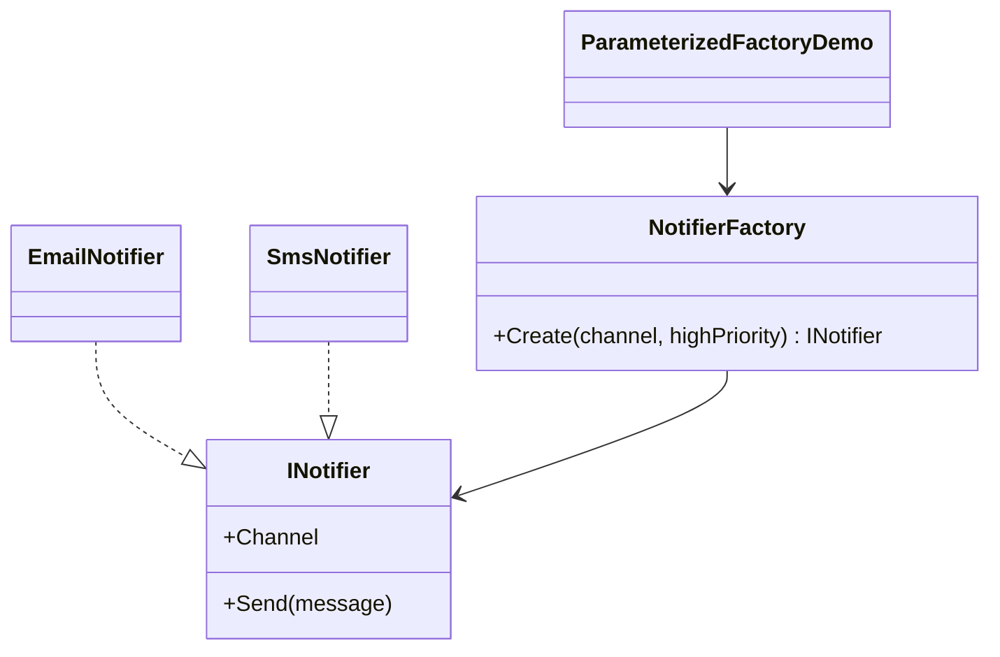

# 02 - Parameterized Factory

This example expands the simple factory style by making the factory choose the product using runtime parameters and business rules.

---

## 1. Intro

In this subtype, the object is still created through a factory, but the decision is more dynamic. Instead of checking only one value, the factory looks at multiple inputs.

In the code, the client calls:

```csharp
var notifier = NotifierFactory.Create("email", highPriority: true);
```

The factory then decides whether the best implementation is `EmailNotifier` or `SmsNotifier`.

---

## 2. Core Components Design Pattern

| Role | Type in code | Responsibility |
| --- | --- | --- |
| **Product** | `INotifier` | Common notification contract |
| **Concrete Products** | `EmailNotifier`, `SmsNotifier` | Different notification channels |
| **Factory** | `NotifierFactory` | Chooses the notifier based on runtime inputs |
| **Client** | `ParameterizedFactoryDemo.Create()` | Uses the abstraction only |

### Implementation flow

1. The client asks the factory for an `INotifier`.
2. `NotifierFactory.Create(channel, highPriority)` receives the request.
3. The factory checks whether the message is high priority or whether the selected channel is SMS.
4. If the rule matches, it creates `SmsNotifier`.
5. Otherwise, it creates `EmailNotifier`.
6. The client sends the message through the interface.

---

## 3. Sub Types of It

This example represents the **Parameterized Factory** subtype.

### Available concrete products in this subtype

#### Email Notifier
- Class: `EmailNotifier`
- `Channel => "Email"`
- Sends output like `Email sent: message`

#### SMS Notifier
- Class: `SmsNotifier`
- `Channel => "SMS"`
- Sends output like `SMS sent: message`

### How it differs from the other Factory Method variants

- Compared to **Simple Factory**, it uses more detailed runtime rules.
- Compared to **Virtual Constructor**, it still keeps all creation logic inside one factory instead of distributing it across subclasses.
- It is suitable when product choice depends on input conditions.

---

## 4. Which SOLID Principle Implemented in This Pattern

### **SRP — Single Responsibility Principle**
- notifier classes send notifications
- `NotifierFactory` decides which notifier to create

### **DIP — Dependency Inversion Principle**
- the client works with `INotifier`
- concrete channel classes are hidden behind the interface

### **OCP — Open/Closed Principle**
- partially supported
- new channels can be added, but the factory logic may need to change

---

## 5. UML Diagram



---

## 6. Types — Subtype One by One Example

### Example: Email path

```csharp
var notifier = NotifierFactory.Create("email", highPriority: false);
var result = notifier.Send("Normal status update");
```

### Example: SMS path

```csharp
var notifier = NotifierFactory.Create("email", highPriority: true);
var result = notifier.Send("Deployment completed");
```

Because the priority is high, the factory returns `SmsNotifier`.

---

## Summary

This subtype shows that factories can make smarter decisions using runtime data while still keeping the client loosely coupled and clean.