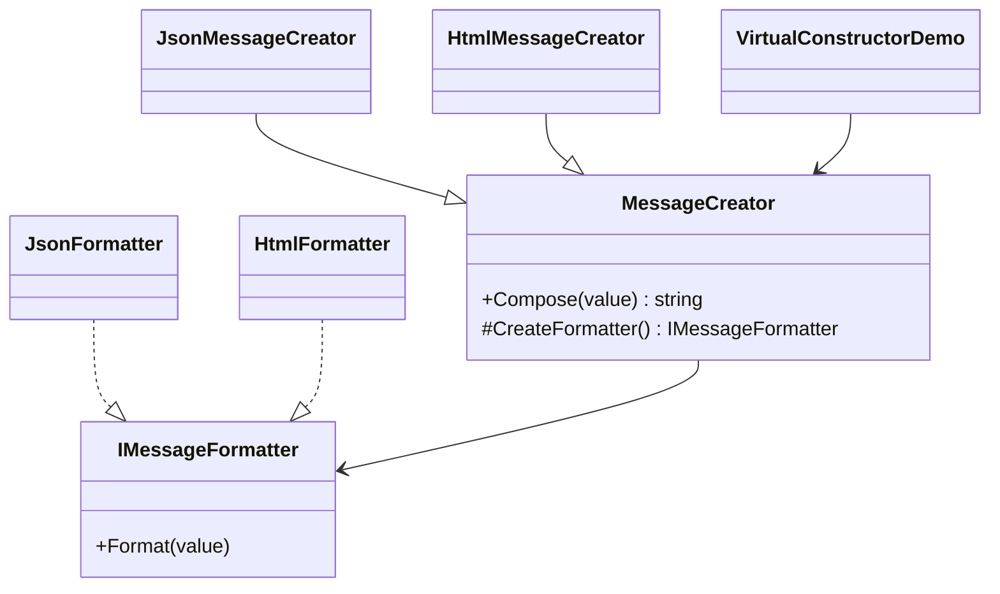

# 03 - Virtual Constructor

This example is the closest match to the original GoF Factory Method pattern because it uses inheritance and an overridable factory method.

---

## 1. Intro

Unlike the previous examples, this subtype does not rely on a single static factory method. Instead, a base class defines the workflow and delegates product creation to subclasses.

In the code:

- `MessageCreator` defines the main algorithm in `Compose()`
- `CreateFormatter()` is the factory method
- subclasses override that method to decide which concrete formatter to create

This is why it is often called a **virtual constructor** style.

---

## 2. Core Components Design Pattern

| Role | Type in code | Responsibility |
| --- | --- | --- |
| **Product** | `IMessageFormatter` | Common formatting contract |
| **Concrete Products** | `JsonFormatter`, `HtmlFormatter` | Produce output in different formats |
| **Creator** | `MessageCreator` | Contains the general workflow in `Compose()` |
| **Factory Method** | `CreateFormatter()` | Returns the correct formatter |
| **Concrete Creators** | `JsonMessageCreator`, `HtmlMessageCreator` | Override the factory method |
| **Client** | `VirtualConstructorDemo.Create()` | Calls the common workflow |

### Implementation flow

1. The client chooses a concrete creator such as `JsonMessageCreator`.
2. The client calls `Compose(value)`.
3. The base class method runs the shared algorithm.
4. Inside that method, `CreateFormatter()` is called.
5. The subclass override returns the correct formatter implementation.
6. The final output is produced without changing the client code.

---

## 3. Sub Types of It

This example represents the **Virtual Constructor** subtype of Factory Method.

### Concrete formatter types

#### JSON Formatter path
- `JsonMessageCreator` creates `JsonFormatter`
- output example: `{ "message": "Hello" }`

#### HTML Formatter path
- `HtmlMessageCreator` creates `HtmlFormatter`
- output example: `<p>Hello</p>`

### How it differs from the other variants

- Compared to **Simple Factory**, it uses polymorphism rather than a centralized static method.
- Compared to **Parameterized Factory**, it avoids putting all conditional logic in one place.
- It is more scalable when many product families or output types are added.

---

## 4. Which SOLID Principle Implemented in This Pattern

### **SRP — Single Responsibility Principle**
- `MessageCreator` manages the creation workflow
- formatter classes only format messages

### **OCP — Open/Closed Principle**
- new formatters can be added by introducing a new creator subclass and a new formatter implementation
- existing workflow code remains unchanged

### **DIP — Dependency Inversion Principle**
- the base creator depends on `IMessageFormatter`, not concrete formatter classes

### **LSP — Liskov Substitution Principle**
- any concrete creator can be used wherever `MessageCreator` is expected

---

## 5. UML Diagram



---

## 6. Types — Subtype One by One Example

### Example: JSON creator

```csharp
MessageCreator creator = new JsonMessageCreator();
var output = creator.Compose("Hello from the factory method pattern");
```

### Example: HTML creator

```csharp
MessageCreator creator = new HtmlMessageCreator();
var output = creator.Compose("Hello from the factory method pattern");
```

The client code remains the same, but the actual formatter changes based on the creator subclass.

---

## Summary

This subtype demonstrates the true strength of Factory Method: **the algorithm stays stable, while subclasses control what concrete object gets created.**