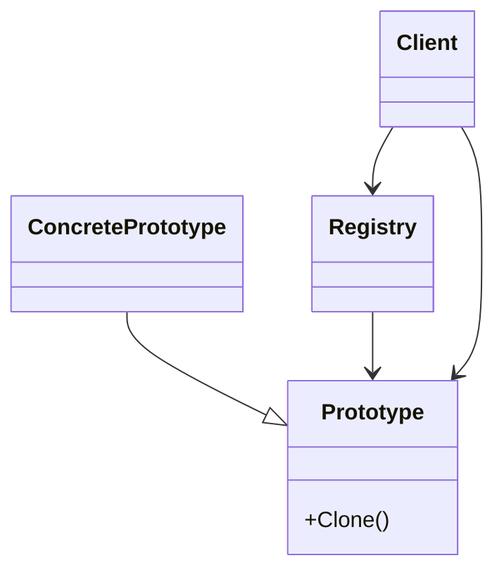

# Prototype

This solution demonstrates how to create new objects by **cloning existing instances** instead of constructing every object from the beginning.

---

## 1. Intro

The **Prototype** pattern is a **creational design pattern** used when copying an existing configured object is more efficient or more convenient than building a new one from scratch.

## Definition

**Prototype** creates new objects by cloning an existing prototype instance. The client asks for a copy rather than directly constructing a new object with all fields again.

This pattern is especially useful when setup is expensive, repetitive, or when predefined templates should be reused safely.

---

## 2. Core Components of the Design Pattern

| Pattern Role | Responsibility | Example from this solution |
| --- | --- | --- |
| **Prototype** | Declares or provides cloning behavior | `CustomerProfile`, `TemplateDocument` |
| **Concrete Prototype** | Implements the actual copy logic | shallow and deep copy implementations |
| **Clone Method** | Produces a new object from the existing instance | `MemberwiseClone()`, `DeepClone()` |
| **Prototype Registry** | Stores reusable named templates | `DocumentRegistry` |
| **Client** | Requests clones and customizes them | Demo methods in each `PatternDemo.cs` |

### How the current code implements this pattern

- a prototype object starts with meaningful initial state
- the clone operation creates a new object based on that state
- the examples compare shallow and deep copying behavior
- a registry-based example shows how templates can be reused on demand

---

## 3. Sub Types of Prototype in this Solution

### 01 - Shallow Copy

Copies the outer object, but nested reference-type objects are still shared.

### 02 - Deep Copy

Duplicates both the outer object and its nested reference objects so the clone is fully independent.

### 03 - Clone Registry

Stores reusable prototype templates and returns fresh clones whenever the client asks for one.

---

## 4. How These Variants Differ from Each Other

| Variant | Copy behavior | Isolation level | Best learning point |
| --- | --- | --- | --- |
| **Shallow Copy** | Top-level object is copied | Low | Fast copy but shared nested references |
| **Deep Copy** | Full object graph is copied | High | Safe independence between original and clone |
| **Clone Registry** | Clone comes from stored templates | High | Reuse of predefined configurations |

### Difference summary

- **Shallow Copy** is simple but can unintentionally share nested state
- **Deep Copy** avoids side effects by cloning nested objects too
- **Clone Registry** adds a reusable template catalog on top of cloning

---

## 5. Which SOLID Principles Are Applied

### **SRP — Single Responsibility Principle**
The prototype owns cloning behavior, while the client only requests and uses copies.

### **OCP — Open/Closed Principle**
New prototype types can be added without changing the clone-consuming client logic.

### **DIP — Dependency Inversion Principle**
Clients can work with cloneable abstractions or registry abstractions instead of concrete setup details.

---

## 6. UML Diagram



---

## 7. Types — Subtype Examples One by One

### Example 1: Shallow Copy

```csharp
var copy = original.MemberwiseClone();
```

**What happens:**
- a new outer object is created
- nested reference objects may still be shared
- changing nested data can affect both objects

### Example 2: Deep Copy

A dedicated clone method creates new nested objects, so updates to the copy do not change the original.

### Example 3: Clone Registry

The client asks the registry for a named template, receives a fresh clone, and customizes it safely.

---

## How to Validate That This Implementation Is Correct

You can validate the Prototype implementation using this checklist:

- **Cloning creates a new object**: the clone must not be the same reference as the original.
- **Shallow copy behavior is visible**: nested objects should remain shared in the shallow example.
- **Deep copy behavior is isolated**: changing a nested value in the clone should not affect the original.
- **Registry returns fresh clones**: retrieving the same template twice should produce independent copies.
- **Client code reuses templates instead of rebuilding state manually**: cloning should simplify creation.

### Practical validation steps

1. Create an original object and clone it.
2. Confirm the original and clone are different object references.
3. Modify nested data in the shallow copy and verify the original changes too.
4. Modify nested data in the deep copy and verify the original remains unchanged.
5. Request multiple clones from the registry and confirm each one is independent.

If these checks pass, the implementation correctly demonstrates the Prototype pattern.

---

## Summary

The current implementation demonstrates Prototype by starting from an existing configured object and producing new copies, while clearly showing the practical difference between **shallow**, **deep**, and **registry-based** cloning.
