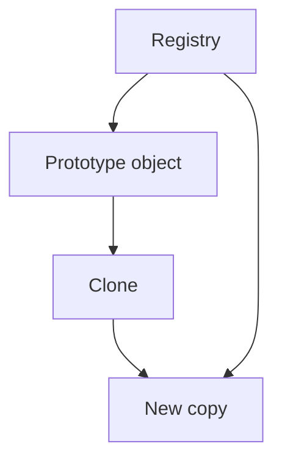

# Prototype

This folder demonstrates how to create new objects by **cloning an existing instance** instead of building every object from scratch.

## How the current implementation demonstrates the pattern

The examples focus on how copying behaves with nested data:

- a prototype object already contains useful state
- clone methods duplicate that state into a new object
- the examples highlight the difference between copying references and copying the full object graph

## Variants in this folder

| Folder | Key types | How it demonstrates Prototype |
| --- | --- | --- |
| 01-ShallowCopy | `CustomerProfile`, `Address` | `MemberwiseClone()` copies the outer object, but nested reference objects are still shared. |
| 02-DeepCopy | `CustomerProfile`, `Address` | `DeepClone()` manually creates a new nested `Address`, so changes to the clone do not affect the original. |
| 03-CloneRegistry | `TemplateDocument`, `DocumentRegistry` | A registry stores reusable prototypes and returns fresh clones on demand. |

## What the current code is showing

### 1. Shallow Copy

The source and the clone are different outer objects, but they still point to the same nested `Address` instance.

### 2. Deep Copy

The clone gets its own nested object, so updating the clone’s city does not change the original profile.

### 3. Clone Registry

The registry acts like a catalog of preconfigured templates. The client asks for a named template, receives a clone, and customizes it safely.

## Diagram

## Summary

The current implementation demonstrates Prototype by starting from an existing configured object and producing new copies, while clearly showing the practical difference between **shallow**, **deep**, and **registry-based** cloning.
