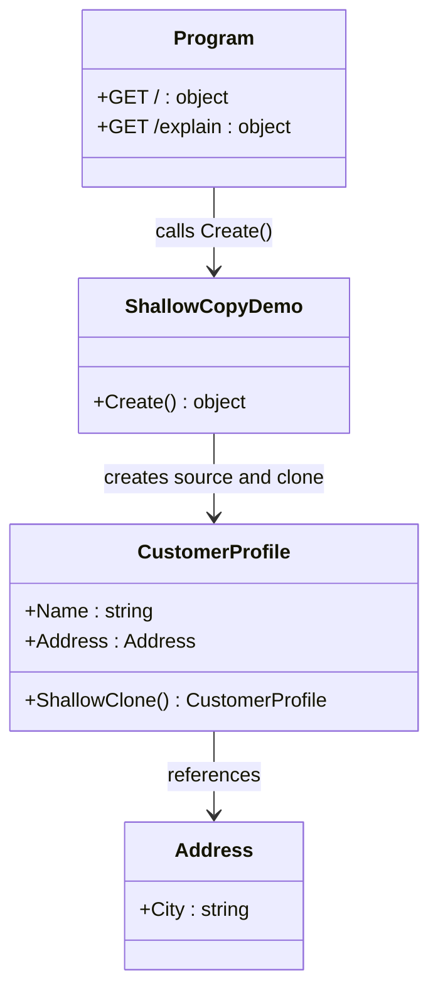

# 01 - Shallow Copy

This subtype demonstrates the fastest Prototype variant: clone only the outer object and keep nested reference-type fields shared.

---

## 1. Intent

Use Prototype to duplicate object state quickly when the root object is enough to copy, and shared nested references are acceptable.

In this variant, `CustomerProfile.ShallowClone()` uses `MemberwiseClone()`.

---

## 2. Core Classes in This Subtype

- `CustomerProfile`
- `Address`
- `ShallowCopyDemo`
- `Program`

### Roles

- `CustomerProfile`: prototype type with `ShallowClone()` for root-level copy.
- `Address`: nested reference object, intentionally shared after cloning.
- `ShallowCopyDemo`: prepares source and clone objects and returns comparison payload.
- `Program`: exposes `/` for demo result and `/explain` for quick pattern summary.

---

## 3. Thread-Safety Behavior

- `ShallowClone()` itself has no mutable static state and is safe as an operation on independent objects.
- The variant is not inherently thread-safe for concurrent writes to the same shared nested `Address` reference.
- If clones are used across threads, synchronization is needed around shared nested state.

---

## 4. Trade-Offs

- Pros: very fast and concise clone logic.
- Pros: useful for immutable or intentionally shared nested objects.
- Cons: nested reference sharing can cause surprising side effects.
- Cons: harder reasoning when one clone mutates shared inner objects.

---

## 5. How It Differs from Other Prototype Variants

- Compared to Deep Copy: this variant keeps nested references shared instead of duplicating the full object graph.
- Compared to Clone Registry: this variant does direct cloning from a single source object, not from keyed stored prototypes.
- Compared to Deep Copy and Clone Registry, this has lower cloning overhead but weaker isolation guarantees.

---

## 6. Code Explanation

```csharp
public sealed class CustomerProfile
{
    public string Name { get; set; } = string.Empty;
    public Address Address { get; set; } = new();

    public CustomerProfile ShallowClone() => (CustomerProfile)MemberwiseClone();
}
```

Explanation:

- `MemberwiseClone()` creates a new `CustomerProfile` instance.
- Value-type data and reference pointers are copied to the new object.
- `Address` remains the same referenced object in both source and clone.
- `/` endpoint returns `SameNestedReference` so the shared-reference behavior is visible.
- `/explain` endpoint provides quick metadata for docs and API discovery.

---

## 7. UML Diagram



---

## Summary

Use shallow copy when you need quick duplication of the outer object and can tolerate shared nested references.
