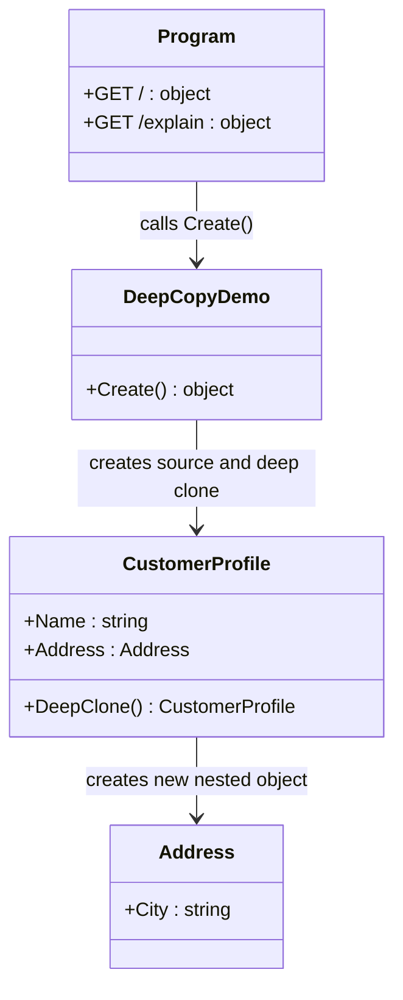

# 02 - Deep Copy

This subtype demonstrates full-state Prototype cloning: clone the root object and duplicate nested reference-type data.

---

## 1. Intent

Use Prototype when clones must be independent from the original, including nested objects.

In this variant, `CustomerProfile.DeepClone()` manually recreates the nested `Address` instance.

---

## 2. Core Classes in This Subtype

- `CustomerProfile`
- `Address`
- `DeepCopyDemo`
- `Program`

### Roles

- `CustomerProfile`: prototype type exposing `DeepClone()` for full copy semantics.
- `Address`: nested reference object that is recreated for each clone.
- `DeepCopyDemo`: demonstrates that mutating clone nested state does not change original state.
- `Program`: exposes `/` for clone behavior demo and `/explain` for compact pattern guidance.

---

## 3. Thread-Safety Behavior

- Deep clone operation does not rely on shared mutable static state.
- Because clone graphs are independent, post-clone contention is reduced compared to shallow copy.
- Thread safety still depends on caller behavior if the same object instance is mutated concurrently.

---

## 4. Trade-Offs

- Pros: clear isolation between original and clone.
- Pros: safer for mutable nested objects.
- Cons: more code and maintenance than shallow copy.
- Cons: can be more expensive for large object graphs.

---

## 5. How It Differs from Other Prototype Variants

- Compared to Shallow Copy: duplicates nested references instead of sharing them.
- Compared to Clone Registry: this variant clones directly from a known instance, not from a key-based registry.
- Compared to Shallow Copy, this variant favors correctness isolation over raw cloning speed.

---

## 6. Code Explanation

```csharp
public CustomerProfile DeepClone()
    => new()
    {
        Name = Name,
        Address = new Address { City = Address.City }
    };
```

Explanation:

- `DeepClone()` constructs a new root object.
- It also constructs a new nested `Address`, copying values rather than references.
- Changing clone values leaves original values unchanged.
- `/` endpoint demonstrates this by mutating `clone.Address.City` and returning original versus clone cities.
- `/explain` endpoint advertises deep-copy intent for consumers.

---

## 7. UML Diagram



---

## Summary

Use deep copy when clone independence is required across both root and nested mutable state.
