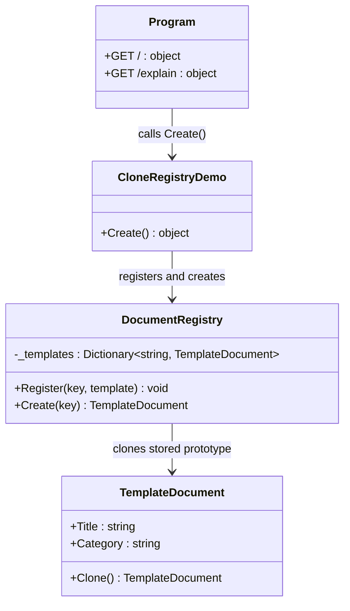

# 03 - Clone Registry

This subtype demonstrates Prototype at scale: maintain prepared prototype objects in a registry and clone by key on demand.

---

## 1. Intent

Use a registry when many callers need predefined templates without sharing the same mutable prototype instance.

In this variant, `DocumentRegistry` stores templates and returns cloned documents through `Create(key)`.

---

## 2. Core Classes in This Subtype

- `TemplateDocument`
- `DocumentRegistry`
- `CloneRegistryDemo`
- `Program`

### Roles

- `TemplateDocument`: prototype model with `Clone()` that creates a new document from stored values.
- `DocumentRegistry`: keyed store of prototypes with `Register` and `Create` methods.
- `CloneRegistryDemo`: registers a template, requests a clone, mutates clone safely.
- `Program`: exposes `/` for runtime demonstration and `/explain` for concise pattern description.

---

## 3. Thread-Safety Behavior

- `DocumentRegistry` uses `Dictionary`, which is not thread-safe for concurrent writes.
- The returned object from `Create` is a fresh clone, so callers do not share mutable document instances.
- For concurrent register/create workflows, add synchronization or use a concurrent collection.

---

## 4. Trade-Offs

- Pros: centralizes template setup and reuse.
- Pros: guarantees fresh cloned instance per request when used correctly.
- Cons: registry lifecycle and key management add complexity.
- Cons: default dictionary implementation needs care under concurrency.

---

## 5. How It Differs from Other Prototype Variants

- Compared to Shallow Copy and Deep Copy: this variant introduces a key-based prototype store.
- Compared to Deep Copy: clone depth is defined by each prototype type's `Clone` implementation.
- Compared to direct cloning variants, this improves reuse for repeated template creation scenarios.

---

## 6. Code Explanation

```csharp
public sealed class DocumentRegistry
{
    private readonly Dictionary<string, TemplateDocument> _templates =
        new(StringComparer.OrdinalIgnoreCase);

    public void Register(string key, TemplateDocument template) => _templates[key] = template;

    public TemplateDocument Create(string key) => _templates[key].Clone();
}
```

Explanation:

- `Register` stores canonical prototype templates by business key.
- `Create` clones the stored prototype and returns the clone, not the stored object.
- Callers can mutate returned documents without changing registry state.
- `/` endpoint demonstrates clone-on-demand from a registered template.
- `/explain` endpoint summarizes registry-based prototype usage.

---

## 7. UML Diagram



---

## Summary

Use Clone Registry when repeated object templates are needed and each request must receive a fresh clone.
