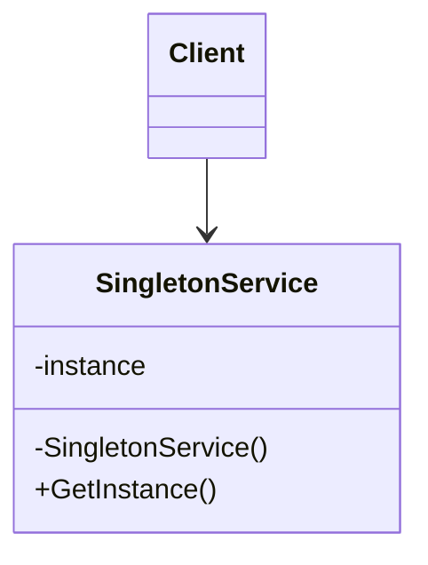

# Singleton

This solution demonstrates how a class can guarantee that only **one instance** exists and provide a single global access point to that instance.

---

## 1. Intro

The **Singleton** pattern is a **creational design pattern** used when exactly one shared object should coordinate or serve the whole application.

## Definition

**Singleton** ensures that a class has only one instance and provides a controlled way for the rest of the system to access it.

Instead of allowing code like this everywhere:

```csharp
var service = new SomeService();
```

Singleton hides construction and forces callers to use a shared access path such as `GetInstance()`.

---

## 2. Core Components of the Design Pattern

| Pattern Role | Responsibility | Example from this solution |
| --- | --- | --- |
| **Singleton Class** | Holds the one allowed instance | `BasicSingletonService`, `ThreadSafeLockService`, `LazyInitializationService` |
| **Private Constructor** | Prevents outside code from calling `new` | Each singleton service implementation |
| **Static Instance Field** | Stores the shared object | private static backing field or `Lazy<T>` |
| **Access Method** | Returns the single shared instance | `GetInstance()` |
| **Client** | Uses the singleton without creating it directly | Demo endpoints in each `PatternDemo.cs` |

### How the current code implements this pattern

- the constructor is hidden from client code
- the instance is stored in static state
- repeated calls return the same object reference
- the demos prove reuse through `SameInstance`, `FirstId`, and `SecondId`

---

## 3. Sub Types of Singleton in this Solution

### 01 - Basic Singleton

Creates and returns one shared instance using the simplest possible approach.

### 02 - Thread-Safe Lock

Adds a `lock` so multiple threads cannot create more than one instance at the same time.

### 03 - Double-Checked Locking

Checks before and inside the lock to reduce locking overhead after initialization.

### 04 - Lazy Initialization

Uses `.NET`'s `Lazy<T>` to defer creation until the instance is actually needed.

### 05 - Eager Initialization

Creates the instance as soon as the type is loaded, which is simple and safe when early creation is acceptable.

---

## 4. How These Variants Differ from Each Other

| Variant | Creation timing | Thread safety | Best learning point |
| --- | --- | --- | --- |
| **Basic Singleton** | Immediate or simple static access | No | Smallest implementation |
| **Thread-Safe Lock** | Lazy | Yes | Correct concurrent access |
| **Double-Checked Locking** | Lazy | Yes | Better performance after initialization |
| **Lazy Initialization** | Lazy | Yes | Preferred built-in .NET approach |
| **Eager Initialization** | Startup time | Yes | Simple and predictable lifecycle |

---

## 5. Which SOLID Principles Are Applied

### **SRP — Single Responsibility Principle**
The singleton class owns one concern: managing its shared instance and exposing its behavior.

### **OCP — Open/Closed Principle**
Different singleton strategies can be introduced without changing how the client consumes the shared service.

### **DIP — Dependency Inversion Principle**
Clients can still depend on abstractions even when the implementation is exposed through a singleton access method.

---

## 6. UML Diagram



---

## 7. Types — Subtype Examples One by One

### Example 1: Basic Singleton

```csharp
var first = BasicSingletonService.GetInstance();
var second = BasicSingletonService.GetInstance();
```

**What happens:**
- both variables reference the same object
- the constructor cannot be called directly
- the class controls its own lifecycle

---

## How to Validate That This Implementation Is Correct

You can confirm the Singleton implementation is correct with the following checks:

- **Only one instance exists**: repeated calls to `GetInstance()` must return the same reference.
- **The constructor is not public**: client code must not be able to directly instantiate the class.
- **Shared state is preserved**: if one caller changes shared data, the next caller sees the same instance state.
- **Thread-safe versions remain safe under concurrency**: lock-based or lazy variants must still create only one object.
- **Client code does not use `new`**: object creation must stay inside the singleton class.

### Practical validation steps

1. Call the same endpoint or demo twice.
2. Compare object identifiers from both responses.
3. Confirm `SameInstance` is `true`.
4. For thread-safe variants, test under concurrent requests and ensure no duplicate instance is created.

If these checks pass, the implementation is correctly demonstrating Singleton.

---

## Summary

The current code demonstrates Singleton by centralizing instance creation in one class, hiding direct construction, and proving that all callers receive the same shared object.
