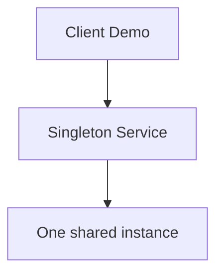

# Singleton

This folder shows multiple ways to ensure that only **one instance** of a service exists and that every caller receives the same object.

## How the current implementation demonstrates the pattern

Each example uses the same core rules:

- the constructor is `private`, so callers cannot create the service directly
- the instance is stored in a static field
- callers go through `GetInstance()`
- the demo compares two returned objects and exposes `SameInstance`, `FirstId`, and `SecondId`

## Variants in this folder

| Folder | Key type | How it works |
| --- | --- | --- |
| 01-BasicSingleton | `BasicSingletonService` | Creates a single static instance up front and always returns it. |
| 02-ThreadSafeLock | `ThreadSafeLockService` | Lazily creates the instance inside a `lock` to make access safe across threads. |
| 03-DoubleCheckedLocking | `DoubleCheckedLockingService` | Checks once before locking and again inside the lock to reduce unnecessary locking. |
| 04-LazyInitialization | `LazyInitializationService` | Uses `.NET`'s `Lazy<T>` to handle deferred, thread-safe creation. |
| 05-EagerInitialization | `EagerInitializationService` | Instantiates the singleton during type initialization through a static field/static constructor path. |

## Why this is a good learning progression

- **Basic Singleton** shows the smallest possible implementation.
- **Thread-Safe (lock)** adds correctness in concurrent access.
- **Double-Checked Locking** improves performance by avoiding a lock after initialization.
- **Lazy Initialization** uses the platform-provided solution.
- **Eager Initialization** is useful when early creation is acceptable and simplicity matters.

## Diagram

## Summary

The current code demonstrates the Singleton pattern by centralizing object creation in one class, hiding the constructor, and proving through repeated calls that the same object instance is reused.
