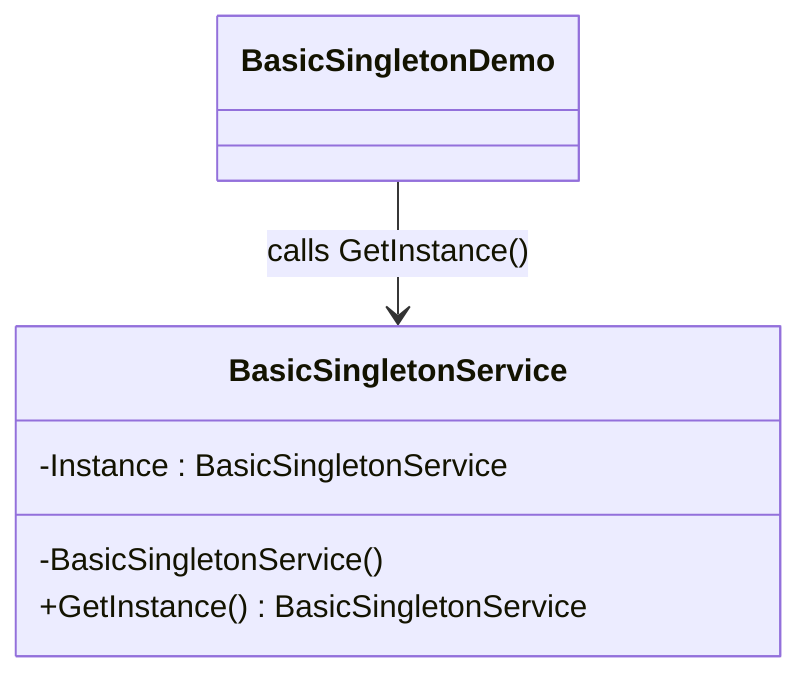

# 01 - Basic Singleton

This subtype shows the simplest Singleton shape: one shared instance exposed through a static access method.

---

## 1. Intent

Use one global service instance and prevent direct construction from outside the class.

In this variant, the instance is created in a static field and returned by GetInstance.

---

## 2. Core Classes in This Subtype

- BasicSingletonService
- BasicSingletonDemo

### Roles

- BasicSingletonService: owns the single instance, private constructor, and shared state.
- BasicSingletonDemo: calls GetInstance twice and confirms both references are the same.

---

## 3. Thread-Safety Behavior

- Thread safe in this implementation because static initialization is handled safely by the .NET runtime.
- No lock is needed for instance creation.

---

## 4. Trade-Offs

- Pros: very small, easy to read, easy to teach.
- Cons: instance is created when type is initialized, even if never used.
- Cons: global state can make tests and dependency management harder if overused.

---

## 5. How It Differs from Other Singleton Variants

- Compared to ThreadSafeLock: avoids lock overhead, but does not defer creation in this code.
- Compared to DoubleCheckedLocking: simpler, no conditional locking logic.
- Compared to LazyInitialization: does not use Lazy<T> for deferred construction.
- Compared to EagerInitialization: very similar creation timing, but this variant is presented as the baseline learning form.

---

## 6. Code Explanation

```csharp
public sealed class BasicSingletonService
{
	private static readonly BasicSingletonService Instance = new();

	private BasicSingletonService() { }

	public static BasicSingletonService GetInstance() => Instance;
}
```

Explanation:

- private static readonly Instance stores the one shared object.
- private constructor blocks external new calls.
- GetInstance is the only public access path to that object.
- Repeated calls from BasicSingletonDemo return the same reference.

---

## 7. UML Diagram



---

## Summary

Use this subtype first to learn the Singleton rules: private constructor, one shared instance, and controlled global access.
