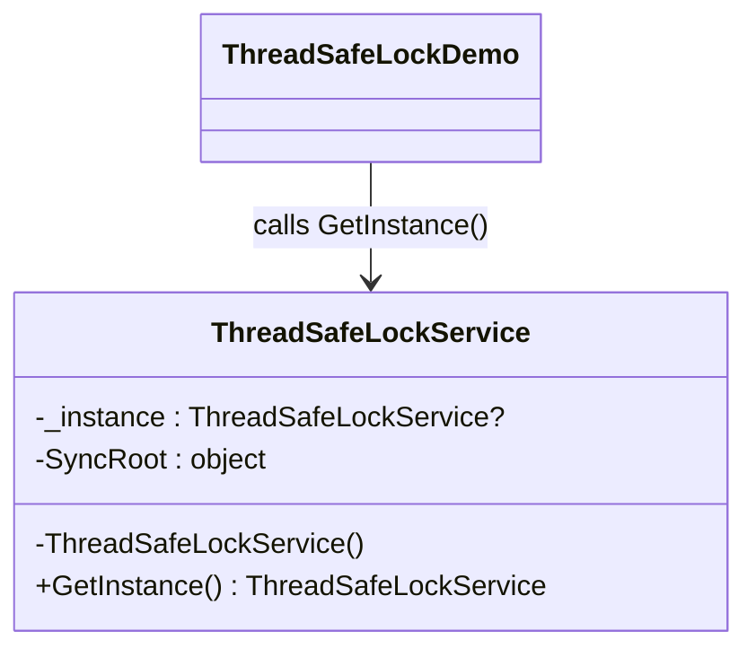

# 02 - Thread-Safe Lock

This subtype demonstrates lazy singleton creation protected with a lock.

---

## 1. Intent

Create the singleton only when needed, while ensuring multiple threads cannot create multiple instances.

---

## 2. Core Classes in This Subtype

- ThreadSafeLockService
- ThreadSafeLockDemo

### Roles

- ThreadSafeLockService: stores nullable instance field, lock object, and synchronized GetInstance path.
- ThreadSafeLockDemo: verifies repeated calls return the same object reference.

---

## 3. Thread-Safety Behavior

- Fully thread safe.
- Every GetInstance call enters a lock, so only one thread can run creation logic at a time.
- Ensures only one instance is ever created.

---

## 4. Trade-Offs

- Pros: simple and correct for concurrent access.
- Pros: lazy creation, so object is not created until first use.
- Cons: lock is taken on every call, which can add overhead in hot paths.

---

## 5. How It Differs from Other Singleton Variants

- Compared to Basic Singleton: adds synchronization and lazy creation.
- Compared to DoubleCheckedLocking: simpler logic but higher runtime locking cost.
- Compared to LazyInitialization: manual lock management instead of runtime-managed Lazy<T>.
- Compared to EagerInitialization: defers allocation instead of creating at type load.

---

## 6. Code Explanation

```csharp
public static ThreadSafeLockService GetInstance()
{
	lock (SyncRoot)
	{
		_instance ??= new ThreadSafeLockService();
		return _instance;
	}
}
```

Explanation:

- _instance starts as null and is created on first request.
- lock (SyncRoot) ensures only one thread can execute creation code at a time.
- ??= creates the object only once.
- All callers receive the same _instance reference afterward.

---

## 7. UML Diagram



---

## Summary

Choose this subtype when correctness under concurrency is the top priority and lock overhead is acceptable.
