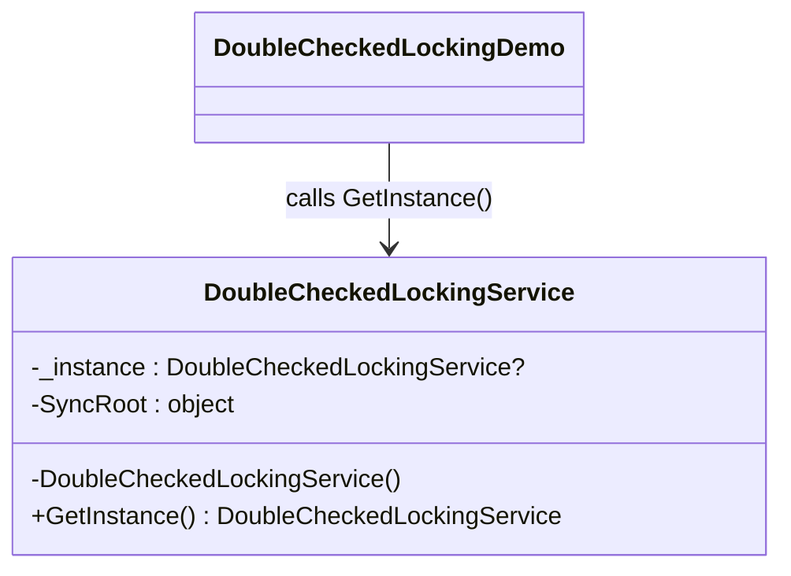

# 03 - Double-Checked Locking

This subtype keeps lazy creation but reduces locking after initialization.

---

## 1. Intent

Avoid paying lock cost on every access by locking only during first-time creation.

---

## 2. Core Classes in This Subtype

- DoubleCheckedLockingService
- DoubleCheckedLockingDemo

### Roles

- DoubleCheckedLockingService: performs a null check before lock, then re-checks inside lock before creating the instance.
- DoubleCheckedLockingDemo: demonstrates that first and second retrievals point to the same singleton object.

---

## 3. Thread-Safety Behavior

- Thread safe in this implementation.
- First access may enter lock; later accesses skip lock once instance is assigned.
- This pattern requires careful implementation discipline to remain correct.

---

## 4. Trade-Offs

- Pros: lazy creation and reduced lock contention after initialization.
- Pros: better steady-state performance than always-lock approach.
- Cons: more complex than lock-every-time and easier to implement incorrectly.

---

## 5. How It Differs from Other Singleton Variants

- Compared to Basic Singleton: introduces lazy creation and synchronization logic.
- Compared to ThreadSafeLock: same correctness goal, but avoids locking after instance exists.
- Compared to LazyInitialization: manual optimization complexity instead of built-in Lazy<T>.
- Compared to EagerInitialization: delays construction and optimizes repeated access.

---

## 6. Code Explanation

```csharp
public static DoubleCheckedLockingService GetInstance()
{
	if (_instance is null)
	{
		lock (SyncRoot)
		{
			_instance ??= new DoubleCheckedLockingService();
		}
	}

	return _instance!;
}
```

Explanation:

- First null check avoids locking after initialization is complete.
- lock (SyncRoot) protects first-time creation under concurrent calls.
- Second check with ??= ensures only one instance is created inside the critical section.
- _instance! is safe because method guarantees assignment before return.

---

## 7. UML Diagram



---

## Summary

Use this subtype when you need lazy, thread-safe singleton access with lower lock overhead after warm-up.
