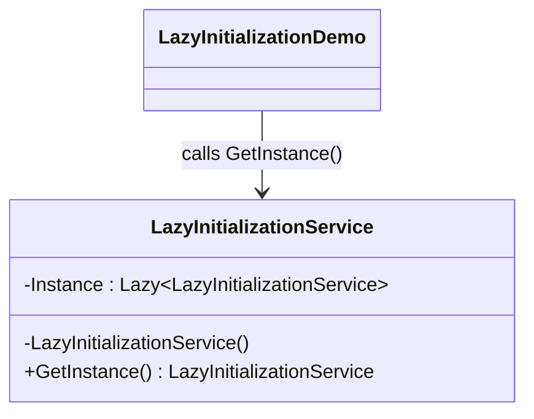

# 04 - Lazy Initialization

This subtype uses Lazy<T> to handle deferred and thread-safe singleton creation.

---

## 1. Intent

Create the singleton only at first use while delegating synchronization mechanics to the framework.

---

## 2. Core Classes in This Subtype

- LazyInitializationService
- LazyInitializationDemo

### Roles

- LazyInitializationService: stores singleton in Lazy<LazyInitializationService> and returns Instance.Value.
- LazyInitializationDemo: confirms repeated calls reuse the same singleton object.

---

## 3. Thread-Safety Behavior

- Thread safe by default with Lazy<T> default mode.
- Runtime manages first-time initialization synchronization.
- Avoids custom lock code in application logic.

---

## 4. Trade-Offs

- Pros: concise, reliable, and usually preferred in modern .NET code.
- Pros: lazy creation without custom lock implementation.
- Cons: introduces Lazy<T> wrapper abstraction, which may be less explicit to beginners.

---

## 5. How It Differs from Other Singleton Variants

- Compared to Basic Singleton: adds deferred creation.
- Compared to ThreadSafeLock: same safety goal with less manual synchronization code.
- Compared to DoubleCheckedLocking: simpler and less error-prone.
- Compared to EagerInitialization: does not allocate until first access.

---

## 6. Code Explanation

```csharp
public sealed class LazyInitializationService
{
	private static readonly Lazy<LazyInitializationService> Instance =
		new(() => new LazyInitializationService());

	private LazyInitializationService() { }

	public static LazyInitializationService GetInstance() => Instance.Value;
}
```

Explanation:

- Lazy<LazyInitializationService> defers object creation until Value is requested.
- The lambda defines how to construct the singleton.
- Default Lazy<T> mode provides thread-safe initialization.
- GetInstance returns Instance.Value, which is created once and then reused.

---

## 7. UML Diagram



---

## Summary

Choose this subtype when you want the cleanest balance of readability, lazy creation, and thread safety.
